# BLM 4522 AG TABANLI PARALEL DAĞITIM SİSTEMLERİ
## PROJE RAPORU: Veri Temizleme ve ETL Süreçleri Tasarımı

**Hazırlayan:** Özge Taraşlı  
**Öğrenci No:** 21290755  

---

## İçindekiler
1. [Giriş](#1-giriş)
   - 1.1 [Kullanılan Ortam](#11-kullanılan-ortam)
   - 1.2 [Veri Tabanı ve Senaryo](#12-veri-tabanı-ve-senaryo)
   - 1.3 [Amaç ve Planlama](#13-amaç-ve-planlama)
2. [ETL Süreçleri ve Uygulama](#2-etl-süreçleri-ve-uygulama)
   - 2.1 [Staging (Ara Katman) Oluşturma](#21-staging-ara-katman-oluşturma)
   - 2.2 [Veri Bozulma ve Kalite Testleri](#22-veri-bozulma-ve-kalite-testleri)
   - 2.3 [Veri Temizleme Stratejileri (Transform)](#23-veri-temizleme-stratejileri-transform)
   - 2.4 [Veri Dönüştürme ve Zenginleştirme](#24-veri-dönüştürme-ve-zenginleştirme)
   - 2.5 [Veri Yükleme (Load)](#25-veri-yükleme-load)
   - 2.6 [Veri Kalitesi Kontrolü ve Raporlama](#26-veri-kalitesi-kontrolü-ve-raporlama)
3. [Sonuç](#3-sonuç)

---

## 1. Giriş
Bu proje, modern veri ambarı mimarilerinde kritik bir rol oynayan **ETL (Extract, Transform, Load)** süreçlerinin tasarımını ve uygulanmasını konu almaktadır. Veri temizleme süreçleri; kirli veya tutarsız verilerin analiz öncesinde ayıklanarak veri kalitesinin artırılmasını hedefler.

### 1.1 Kullanılan Ortam
- **Veritabanı Sistemi:** Microsoft SQL Server 2022
- **Yönetim Aracı:** SQL Server Management Studio (SSMS)
- **Örnek Veri Seti:** Northwind Database

### 1.2 Veri Tabanı ve Senaryo
Projede **Northwind** veritabanı üzerinden `Customers` ve `Orders` tabloları temel alınmıştır. Gerçek dünya senaryolarında üretim veritabanından alınan verilerin temizlenip analiz edilmek üzere bir veri ambarına aktarılması simüle edilmiştir. Proje kapsamında tek bir kaynak veritabanı kullanılmış; çok kaynaklı entegrasyon senaryosu bu tek kaynak üzerinden simüle edilmiştir.

### 1.3 Amaç ve Planlama
Projenin temel amacı, ham veriyi alıp belirli kurallara göre temizleyerek tutarlı bir hale getirmektir:
- **Extract (Çekme):** Orijinal tabloların kopyalarının (Staging) oluşturulması.
- **Transform (Dönüştürme):** Hatalı verilerin (NULL değerler, mükerrer kayıtlar, gereksiz boşluklar) tespiti ve düzeltilmesi.
- **Load (Yükleme):** Temizlenen verinin hedef tabloya aktarılması.

---

## 2. ETL Süreçleri ve Uygulama

### 2.1 Staging (Ara Katman) Oluşturma
Orijinal verilere zarar vermemek ve çalışma alanını ayırmak için staging tabloları oluşturulmuştur. `1_STAGING.sql` scripti ile `Customers` ve `Orders` tabloları ara katmana taşınmıştır.

```sql
-- Staging müşteri tablosu oluşturma
SELECT * INTO Customers_Staging FROM Customers;

-- Staging sipariş tablosu oluşturma
SELECT * INTO Orders_Staging FROM Orders;
```
Yandaki tablolar kısmından `Customers_Staging` ve `Orders_Staging` tablolarını görebiliriz.

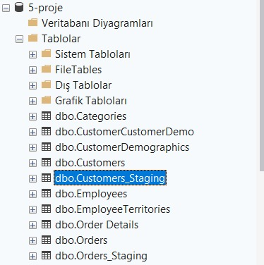

Aşağıdaki sorguları çalıştırarak da tabloların içeriğini kontrol edebiliriz:

```sql
SELECT * FROM Customers_Staging;
SELECT * FROM Orders_Staging;
```

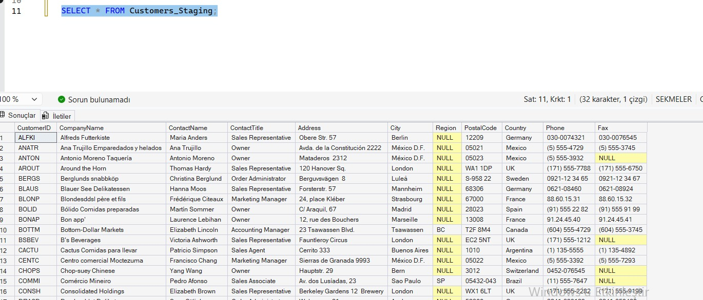

### 2.2 Veri Bozulma ve Kalite Testleri
Veri temizleme mantığını test edebilmek amacıyla, staging tablolarında kasıtlı olarak veri kalitesi hataları oluşturulmuştur (`2_Verileri_Bozma.sql`).

- **NULL Değerler:** `ALFKI` kodlu müşterinin şehir bilgisi silinmiştir.
```sql
UPDATE Customers_Staging
SET City = NULL
WHERE CustomerID = 'ALFKI';
```

- **Tutarsız Veri:** Ülke isimleri küçük harfe dönüştürülmüş veya farklı formatlarda yazılmıştır.
```sql
UPDATE Customers_Staging
SET Country = 'turkiye'
WHERE CustomerID = 'ANATR';
```

- **Boşluk Sorunları:** İsimlerin önüne ve arkasına gereksiz boşluklar eklenmiştir.
```sql
UPDATE Customers_Staging
SET CompanyName = '   ABC Company   '
WHERE CustomerID = 'ANTON';
```

- **Mükerrer Kayıtlar:** Belirli bir kayıt (`AROUT`) tabloya tekrar eklenerek mükerrer (duplicate) veri sorunu simüle edilmiştir.
```sql
INSERT INTO Customers_Staging
SELECT * FROM Customers_Staging
WHERE CustomerID = 'AROUT';
```

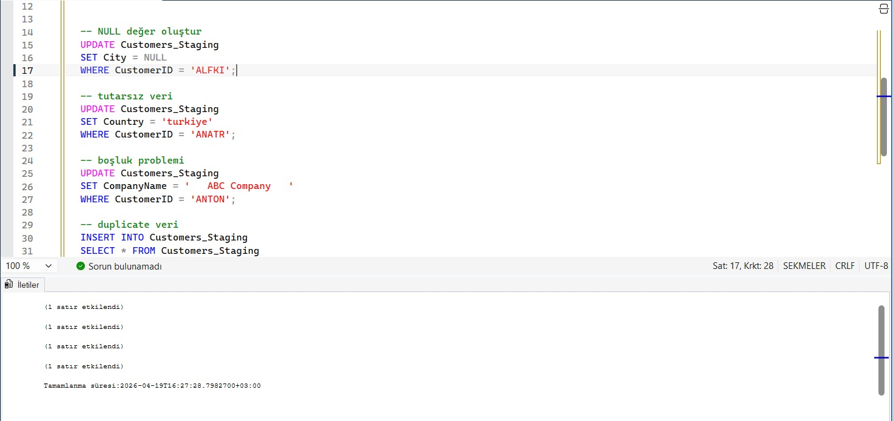

### 2.3 Veri Temizleme Stratejileri (Transform)
`3_Veri_temizleme.sql` scripti ile uygulanan temel temizleme adımları şunlardır:

**1. NULL Yönetimi:** Eksik şehir bilgilerinin "Unknown" olarak güncellenmesi.

1.1. NULL değerleri bulma: Yanlış verilerin tespiti ve doğru kayıtların hedeflendiğini doğrulamak için kullanılır.
```sql
SELECT *
FROM Customers_Staging
WHERE City IS NULL;
```
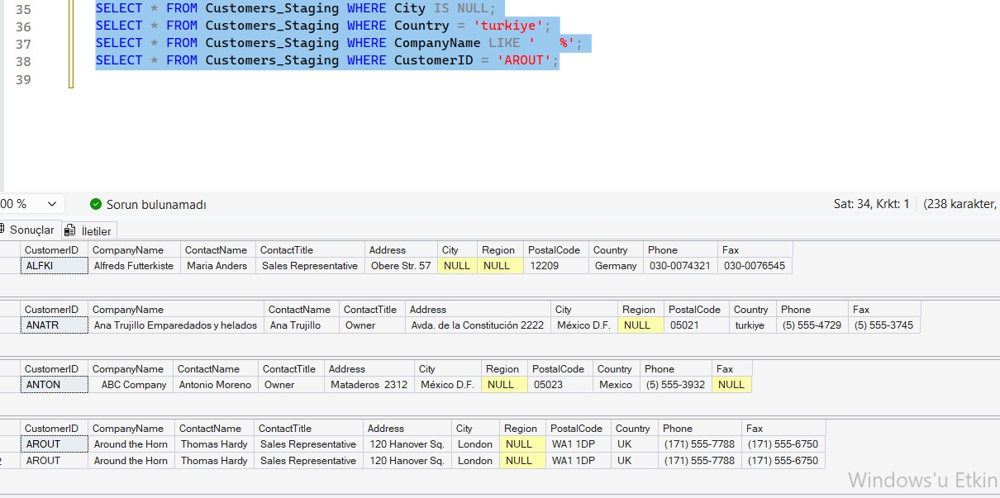

1.2. NULL değerleri düzeltme:
```sql
UPDATE Customers_Staging
SET City = 'Unknown'
WHERE City IS NULL;
```
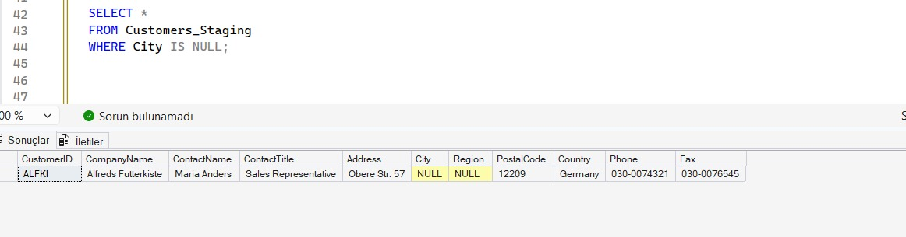

1.3. Doğrulama: Adım 1.1'deki sorgu tekrar çalıştırıldığında NULL değerlerinin kalmadığı görülür. Bu, işlemin başarıyla tamamlandığını gösterir.
```sql
SELECT *
FROM Customers_Staging
WHERE City IS NULL;
```
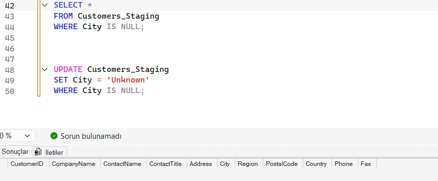

**2. Duplicate Kontrolü:** Mükerrer kayıtların ayıklanarak tekilleştirilmesi.

2.1. Mükerrer kayıtları bulma:
```sql
SELECT CustomerID, COUNT(*) as sayi
FROM Customers_Staging
GROUP BY CustomerID
HAVING COUNT(*) > 1;
```
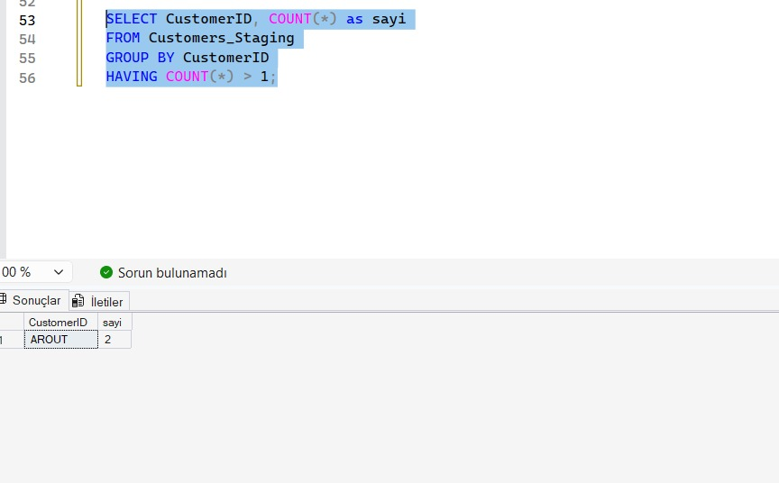

2.2. Mükerrer kayıtları silme:
```sql
WITH CTE AS (
    SELECT *,
    ROW_NUMBER() OVER (PARTITION BY CustomerID ORDER BY CustomerID) as rn
    FROM Customers_Staging
)
DELETE FROM CTE WHERE rn > 1;
```
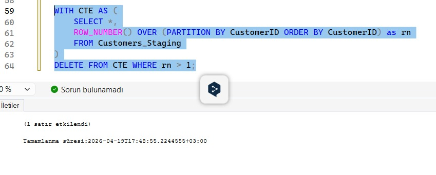

2.3. Doğrulama: Silindiğini teyit etmek için ilgili sorgu tekrar çalıştırılır.
```sql
SELECT CustomerID, COUNT(*) as sayi
FROM Customers_Staging
GROUP BY CustomerID
HAVING COUNT(*) > 1;
```
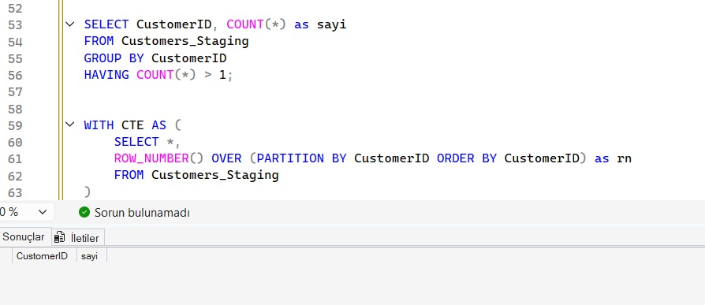

**3. TRIM İşlemi:** İsimlerdeki baş ve son boşlukların temizlenmesi (`LTRIM` ve `RTRIM`).

3.1. Boşlukları temizleme:
```sql
UPDATE Customers_Staging
SET CompanyName = LTRIM(RTRIM(CompanyName));
```
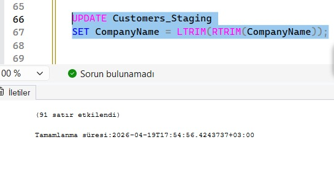

3.2. Doğrulama: Boş bir sonuç kümesi dönmesi, verilerin temizlendiğini gösterir.
```sql
SELECT CompanyName
FROM Customers_Staging
WHERE CompanyName LIKE ' %' OR CompanyName LIKE '% ';
```
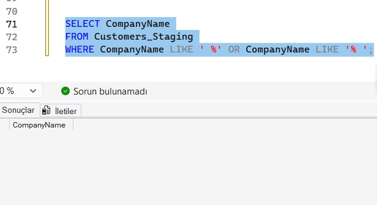

**4. Standartlaştırma:** Ülke isimlerinin standart büyük harf formatına dönüştürülmesi.

4.1. Büyük/küçük harf tutarsızlıklarını düzeltme:
```sql
UPDATE Customers_Staging
SET Country = UPPER(Country);
```
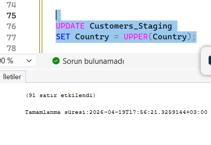

4.2. Doğrulama: Tüm kayıtların büyük harf formatında olduğu kontrol edilir.
```sql
SELECT DISTINCT Country FROM Customers_Staging;
```
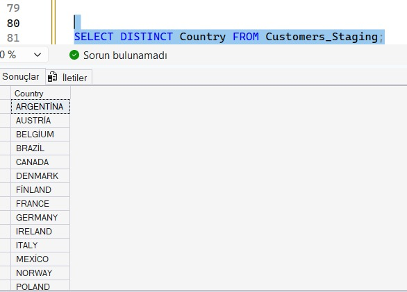

**5. Mantıksız Veri Kontrolü:** Gelecekteki sipariş tarihlerinin düzeltilmesi.

5.0. Hata Simülasyonu: Temizleme mantığını test etmek amacıyla staging tablosuna kasıtlı olarak hatalı bir tarih değeri eklenmiştir.

```sql
UPDATE Orders_Staging
SET OrderDate = '2099-01-01'
WHERE OrderID = 10248;
```
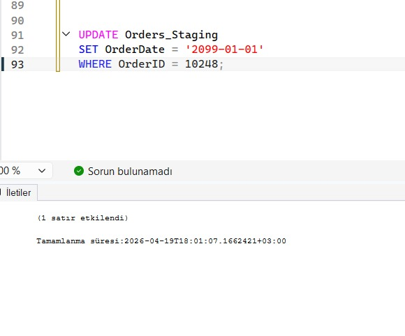

5.1. Mantıksız verileri bulma: Hata eklendikten sonra gelecek tarihli kayıtlar sorgulanarak hatalı kaydın göründüğü doğrulanır.
```sql
SELECT *
FROM Orders_Staging
WHERE OrderDate > GETDATE();
```
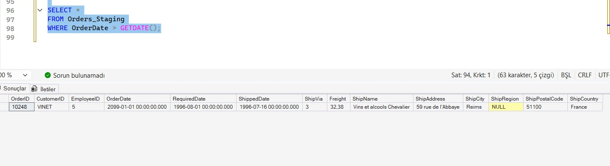

5.2. Mantıksız verileri düzeltme:
```sql
UPDATE Orders_Staging
SET OrderDate = GETDATE()
WHERE OrderDate > GETDATE();
```
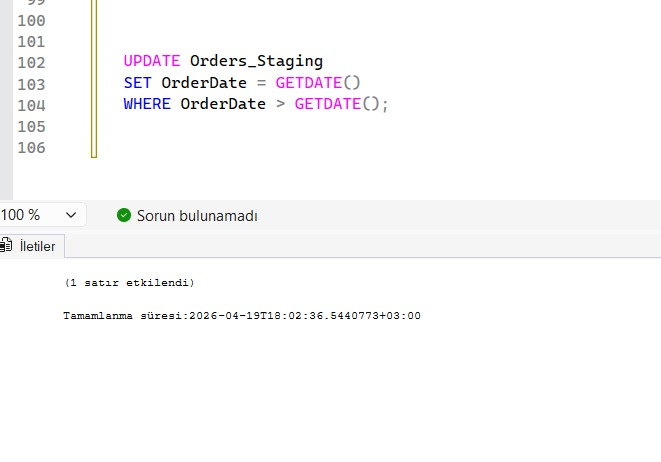

5.3. Doğrulama: Düzeltme sonrasında sorgu boş küme döndürür; bu işlemin başarıyla tamamlandığını gösterir.
```sql
SELECT *
FROM Orders_Staging
WHERE OrderDate > GETDATE();
```
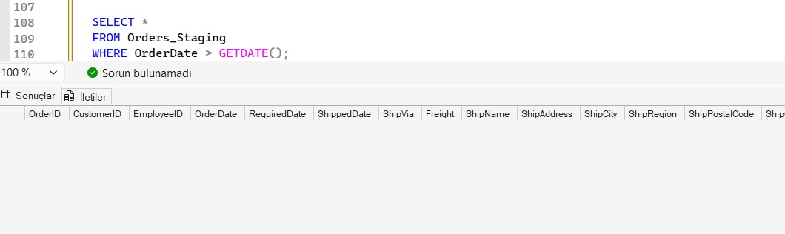

### 2.4 Veri Dönüştürme ve Zenginleştirme
Veriler temizlendikten sonra, analiz süreçlerini kolaylaştırmak ve daha anlamlı hale getirmek için dönüştürme (transform) ve zenginleştirme işlemleri uygulanmıştır (`4_Veri_dönüstürme.sql`).

**1. Yeni Alan Oluşturma (OrderYear):**
Yıl bazlı analizleri hızlandırmak için sipariş tarihlerinden yıl bilgisi çıkarılarak yeni bir kalıcı sütuna atanmıştır.
```sql
ALTER TABLE Orders_Staging ADD OrderYear INT;

UPDATE Orders_Staging SET OrderYear = YEAR(OrderDate);
```
Sorgu sonucunda `OrderDate` sütunundan türetilen `OrderYear` sütunu tabloya eklenmiştir.

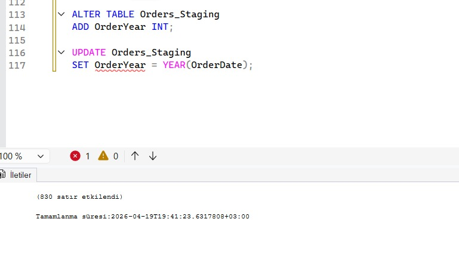

Kontrol etmek için aşağıdaki sorguyu çalıştırırız. Gelen tabloda yeni oluşturulan sütunları görürüz.

```sql
SELECT OrderDate, OrderYear
FROM Orders_Staging;
```

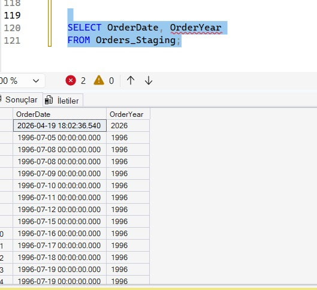

**2. Veri Kategorizasyonu (FreightCategory):**
Sayısal olan kargo ücretleri (`Freight`), 'LOW', 'MEDIUM' ve 'HIGH' olmak üzere kategorize edilerek verinin daha kolay yorumlanması sağlanmıştır. Bu kategorizasyon analitik sorgularda kullanılmak üzere tasarlanmıştır; `Clean_Orders` nihai tablosuna yüklenirken de aynı `CASE` ifadesi uygulanmaktadır.
```sql
SELECT OrderID, Freight,
       CASE 
           WHEN Freight < 50 THEN 'LOW'
           WHEN Freight BETWEEN 50 AND 100 THEN 'MEDIUM'
           ELSE 'HIGH'
       END as FreightCategory
FROM Orders_Staging;
```
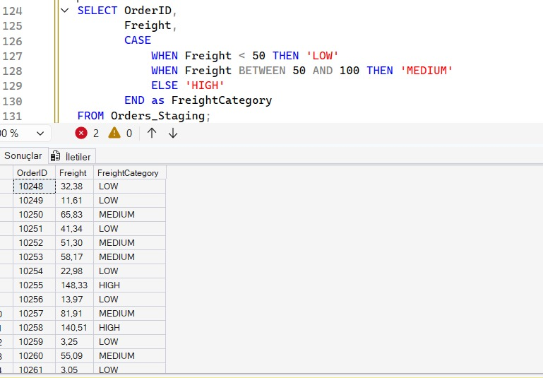

**3. Veri Zenginleştirme (JOIN):**
Sipariş verileri ile müşteri verileri birleştirilerek, hangi siparişin hangi şirket tarafından verildiği bilgisi tek bir görünümde toplanmıştır.
```sql
SELECT o.OrderID, c.CompanyName, o.OrderDate
FROM Orders_Staging o
JOIN Customers_Staging c
ON o.CustomerID = c.CustomerID;
```
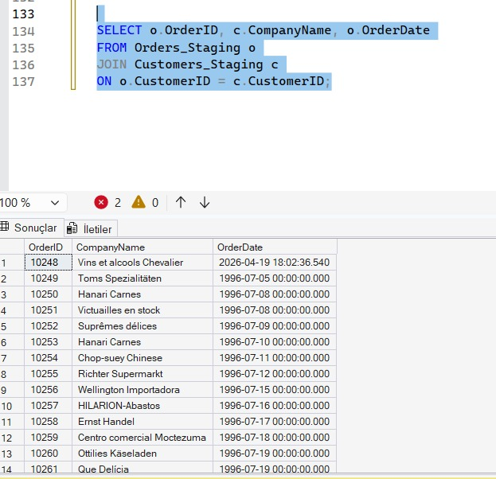

### 2.5 Veri Yükleme (Load)
ETL sürecinin son aşamasında, temizlenen ve dönüştürülen tüm veriler analiz için hazır hale getirilerek nihai tabloya yüklenmiştir (`5_Veri_yükleme.sql`).

**Nihai Tablonun Oluşturulması (`Clean_Orders`):**
Tüm dönüşümler ve join işlemleri uygulanmış veriler `Clean_Orders` adlı yeni bir tabloda kalıcı hale getirilmiştir.
```sql
SELECT 
    o.OrderID,
    c.CompanyName,
    c.Country,
    o.OrderDate,
    YEAR(o.OrderDate) as OrderYear,
    o.Freight,
    CASE 
        WHEN o.Freight < 50 THEN 'LOW'
        WHEN o.Freight BETWEEN 50 AND 100 THEN 'MEDIUM'
        ELSE 'HIGH'
    END as FreightCategory
INTO Clean_Orders
FROM Orders_Staging o
JOIN Customers_Staging c
ON o.CustomerID = c.CustomerID;
```
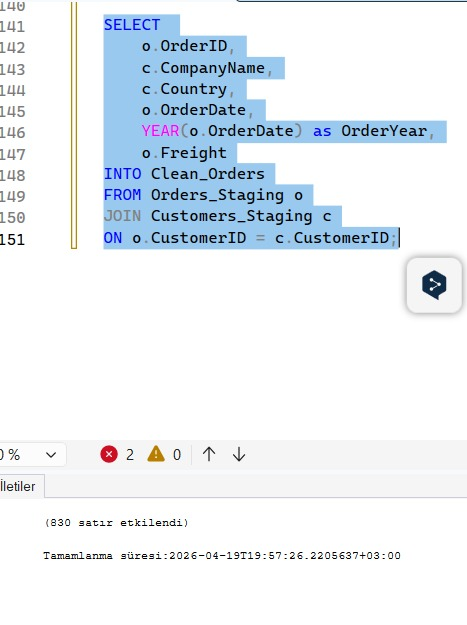

Yeni tablomuzun oluştuğunu görmek için sol taraftaki tablo listesinden de kontrol edebiliriz.

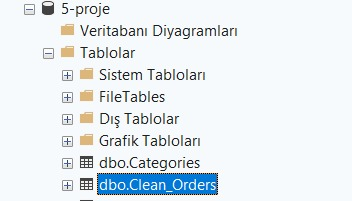

Yükleme işleminin ardından veritabanında oluşan `Clean_Orders` tablosu kontrol edilmiştir:
```sql
SELECT * FROM Clean_Orders;
```
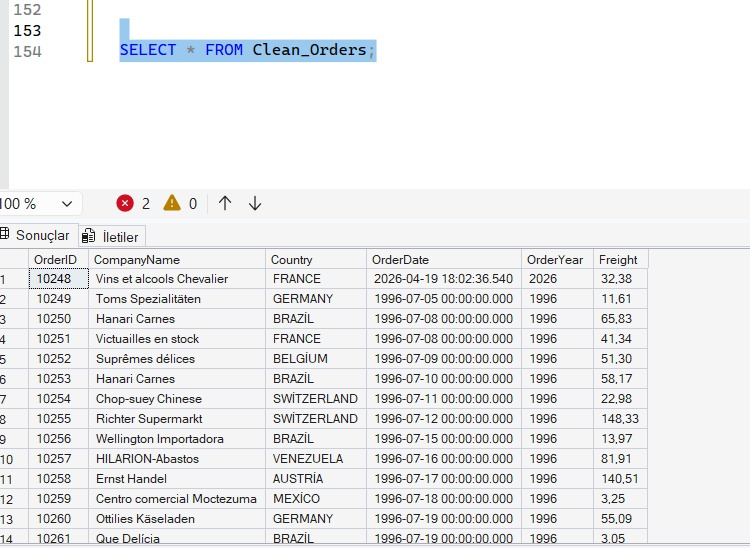

### 2.6 Veri Kalitesi Kontrolü ve Raporlama
ETL süreci tamamlandıktan sonra yapılan veri temizleme ve dönüştürme işlemlerinin başarısını ölçmek amacıyla çeşitli kalite kontrolleri ve raporlama sorguları çalıştırılmıştır (`6_Veri_raporu_kalitesi.sql`).

**1. Eksik Veri ve Düzeltme İstatistikleri:**
Transform aşamasında NULL olan şehir bilgileri 'Unknown' değeriyle güncellenmişti. Bu sorgu, kaç adet kaydın bu şekilde düzeltildiğini sayısal olarak doğrulamak amacıyla çalıştırılmıştır. Sonuç 1 olarak dönmüştür yani staging tablosuna enjekte edilen 1 adet eksik şehir verisi başarıyla doldurulmuştur. 
```sql
SELECT COUNT(*) as EksikSehir FROM Customers_Staging WHERE City = 'Unknown';
```
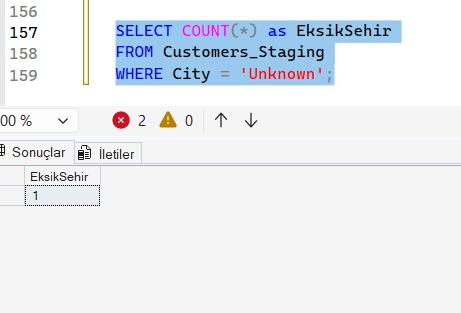

**2. Duplicate Kayıt Sonrası Tablo Durumu:**
Duplicate temizleme işleminin ardından tablodaki toplam kayıt sayısı sorgulanmıştır. Sonuç 91 olarak dönmüştür. Northwind veritabanının orijinal `Customers` tablosu 91 kayıt içermektedir; bu değerle örtüşmesi, simüle edilen mükerrer kaydın (`AROUT`) başarıyla silindiğini ve tablonun özgün boyutuna döndüğünü kanıtlamaktadır.
```sql
SELECT COUNT(*) FROM Customers_Staging;
```
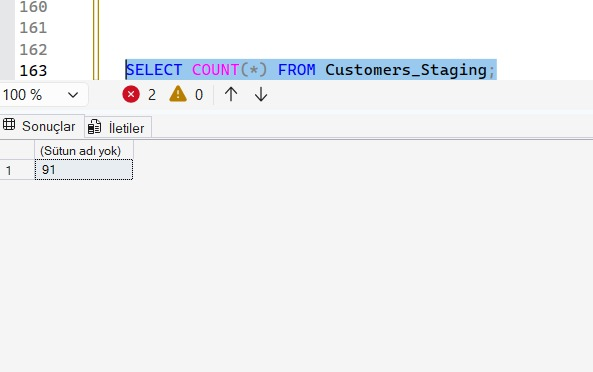

**3. Ülke Dağılımı ve Standartlaştırma Analizi:**
Ülke bazlı müşteri dağılımı sorgulanmıştır. Sonuç kümesinde tüm ülke isimlerinin büyük harf formatında  listelendiği görülmüştür. Özellikle 'turkiye' olarak bozulan değerin 'TURKEY' formatına dönüştürüldüğü doğrulanmıştır. Standartlaştırma yapılmadan bırakılsaydı, aynı ülke farklı yazım biçimleriyle birden fazla satırda görünecek ve ülke bazlı analizlerde hatalı sonuçlar üretilecekti.
```sql
SELECT Country, COUNT(*) as sayi
FROM Customers_Staging
GROUP BY Country;
```
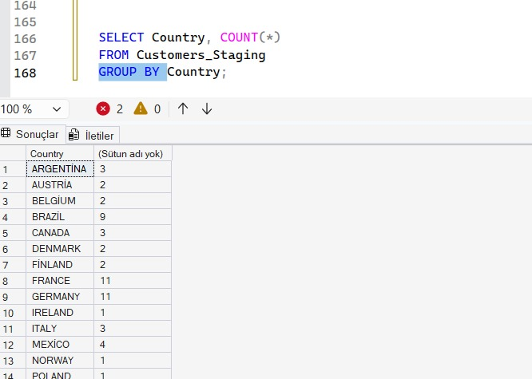

**4. Kargo Ücretleri (Freight) Dağılım Analizi:**
Transform aşamasında oluşturulan FreightCategory mantığı kullanılarak tüm sipariş kayıtlarının maliyet kategorilerine göre dağılımı raporlanmıştır. Sonuçlara göre 470 sipariş LOW (Freight < 50), 173 sipariş MEDIUM (50 ≤ Freight ≤ 100) ve 187 sipariş HIGH (Freight > 100) kategorisinde yer almaktadır. Toplam 830 sipariş kaydının yaklaşık %57'sinin düşük kargo maliyetli olduğu görülmektedir. Bu dağılım, lojistik maliyet optimizasyonu açısından değerlendirilebilecek anlamlı bir örüntüye işaret etmektedir.
```sql
SELECT 
    CASE 
        WHEN Freight < 50 THEN 'LOW'
        WHEN Freight BETWEEN 50 AND 100 THEN 'MEDIUM'
        ELSE 'HIGH'
    END as kategori,
    COUNT(*) as sayi
FROM Orders_Staging
GROUP BY 
    CASE 
        WHEN Freight < 50 THEN 'LOW'
        WHEN Freight BETWEEN 50 AND 100 THEN 'MEDIUM'
        ELSE 'HIGH'
    END;
```
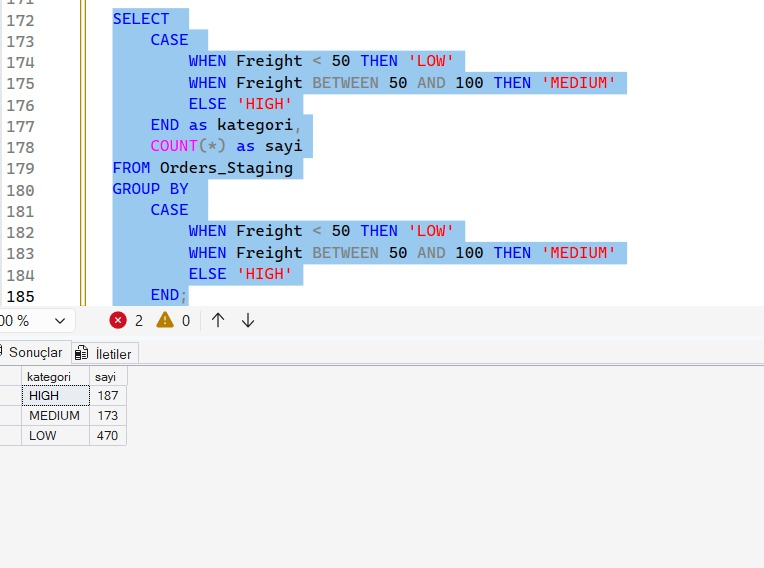

---

## 3. Sonuç
Bu çalışma kapsamında, Northwind veritabanı üzerinde uçtan uca bir **ETL (Extract, Transform, Load)** süreci başarıyla tasarlanmış ve uygulanmıştır. Proje, yalnızca teknik bir veri işleme alıştırması olmanın ötesinde; gerçek dünya veri kalitesi sorunlarının nasıl tespit edilip sistematik biçimde giderileceğini de somut örneklerle ortaya koymaktadır.

**Extract** aşamasında ham veriler, orijinal tablolara hiçbir müdahale yapılmadan staging alanına taşınmıştır. Bu yaklaşım, olası hatalar durumunda geri dönüş imkânı sağladığı için üretim ortamlarında da benimsenen temel bir veri mühendisliği pratiğidir.

**Transform** aşamasında beş farklı veri kalitesi sorunu ele alınmıştır: NULL değerler anlamlı bir varsayılan değerle doldurulmuş, mükerrer kayıtlar `ROW_NUMBER()` pencere fonksiyonu kullanılarak tekilleştirilmiş, şirket isimlerindeki baş/son boşluklar `LTRIM`/`RTRIM` ile temizlenmiş, ülke isimleri `UPPER()` fonksiyonuyla standart formata dönüştürülmüş ve mantıksız gelecek tarihli sipariş kayıtları düzeltilmiştir. Bu adımların her biri, hem uygulama öncesi hem de sonrasında doğrulama sorguları ile teyit edilmiştir. Ek olarak veriler, `OrderYear` türetilmiş sütunu ve `FreightCategory` kategorizasyonuyla analitik açıdan zenginleştirilmiştir.

**Load** aşamasında ise tüm dönüşümler tek bir sorgu içinde birleştirilerek `Clean_Orders` adlı nihai tabloya yüklenmiştir. Bu tablo; sipariş kimliği, şirket adı, ülke, sipariş tarihi, sipariş yılı, kargo ücreti ve kargo kategorisi alanlarını bir arada sunmakta ve analitik sorgulamaya doğrudan hazır bir yapı sunmaktadır.

Kalite kontrol raporlaması sonucunda elde edilen sayısal bulgular şu şekilde özetlenebilir: 1 adet NULL şehir verisi düzeltilmiş, 1 adet mükerrer kayıt silinmiş, tüm 91 müşteri kaydı standart büyük harf formatına getirilmiş ve 1 adet mantıksız tarih verisi giderilmiştir. Sipariş verileri incelendiğinde toplam 830 kaydın 470'inin (%57) düşük, 173'ünün (%21) orta ve 187'sinin (%22) yüksek kargo maliyeti kategorisinde yer aldığı görülmektedir.

Sonuç olarak, ham ve kirli veriden yola çıkılarak analiz süreçlerine doğrudan girdi sağlayabilecek, tutarlı, tekilleştirilmiş ve zenginleştirilmiş bir veri seti başarıyla üretilmiştir.