# 2. Veritabanı Yedekleme ve Felaketten Kurtarma Planı
Ağ Tabanlı Paralel Dağıtım Sistemleri dersi için yapılan 2. Veritabanı Yedekleme ve Felaketten Kurtarma Planı projesi.

**BLM 4522 PROJE RAPORU**

**Özge Taraşlı**  
**21290755**

---

## İçindekiler
1. [Giriş](#1-giriş)  
   1.1 [Kullanılan Ortam](#11-kullanılan-ortam)  
   1.2 [Veri Tabanı Kurulumu](#12-veri-tabanı-kurulumu)  
   1.3 [Amaç ve Planlama](#13-amaç-ve-planlama)  
2. [Yedekleme Stratejileri](#2-yedekleme-stratejileri)  
   2.1 [Tam Yedekleme (Full Backup)](#21-tam-yedekleme-full-backup)  
   2.2 [Fark Yedekleme (Differential Backup)](#22-fark-yedekleme-differential-backup)  
   2.3 [İşlem Günlüğü Yedekleme (Transaction Log Backup)](#23-işlem-günlüğü-yedekleme-transaction-log-backup)  
3. [Zamanlayıcılarla Otomatik Yedekleme](#3-zamanlayıcılarla-otomatik-yedekleme)  
4. [Felaketten Kurtarma Senaryosu](#4-felaketten-kurtarma-senaryosu)  
5. [Yedeklerin Test Edilmesi](#5-yedeklerin-test-edilmesi)  
6. [Sonuç](#6-sonuç)  

---

## 1. Giriş
Bu proje Microsoft SQL Server üzerinde Northwind örnek veri tabanı kullanılarak kapsamlı bir yedekleme ve felaketten kurtarma planının tasarlanması ve uygulanmasını konu almaktadır. Proje boyunca tam yedekleme, fark yedekleme ve transaction log yedekleme stratejileri ele alınmış; bu yedeklerin otomatize edilmesi ve felaket senaryolarında veri kurtarma süreçleri uygulamalı olarak gerçekleştirilmiştir.

### 1.1 Kullanılan Ortam
*   **Veritabanı Sistemi:** Microsoft SQL Server 2022 Developer Edition, Sürüm 16.0.1000.6
*   **Yönetim Aracı:** SQL Server Management Studio (SSMS)

### 1.2 Veri Tabanı Kurulumu
Proje kapsamında kullanılacak örnek veri tabanı olarak Northwind seçilmiştir. Northwind Microsoft tarafından yayımlanmış, bir ticaret şirketinin sipariş, ürün, müşteri ve çalışan verilerini barındıran klasik bir örnek veritabanıdır. Veritabanı SSMS üzerinden başarıyla yüklenmiş ve aşağıdaki sorgu ile doğrulanıp veritabanını yüklediğimiz gösterilmiştir:

```sql
SELECT 
    d.name AS DatabaseName,
    d.state_desc AS Status,
    d.recovery_model_desc AS RecoveryModel
FROM sys.databases d
WHERE d.name = 'Northwind';
```


### 1.3 Amaç ve Planlama
**Amaç:** Bir felaket anında (sunucu çökmesi, yanlışlıkla silme, veri bozulması) veriyi geri getirebilmek.

*   **Full Backup:** Tüm DB'nin şu anki halini kaydetmek
*   **Differential Backup:** Full'dan sonraki değişiklikleri yakalamak
*   **Transaction Log Backup:** Saatlik/dakikalık değişiklikleri yakalamak
*   **Otomatik Zamanlama:** Bu yedeklemelerin SQL Agent ile otomatik çalışmasını sağlamak
*   **Test Aşaması:** DB'yi silmek / veriyi bozmak
*   **Kurtarma:** Bozulan veya silinen veriyi geri yüklemeye çalışmak

---

## 2. Yedekleme Stratejileri

İlgili `.sql` dosyası: `01_Backup_Strategies.sql`

### 2.1 Tam Yedekleme (Full Backup)
Tam yedekleme veri tabanının tüm verilerini ve log dosyasını tek bir `.bak` dosyasına yazar. Diğer yedekleme türlerinin temeli olduğundan ilk adım olarak uygulanmıştır.

```sql
BACKUP DATABASE Northwind 
TO DISK = 'C:\SQLBackups\Northwind_Full.bak'
WITH FORMAT, 
MEDIANAME = 'NorthwindBackups', 
NAME = 'Full Backup of Northwind';
GO
```
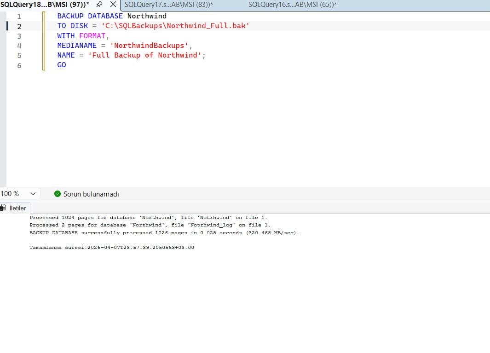

### 2.2 Fark Yedekleme (Differential Backup)
Son tam yedeklemeden (Full Backup) bu yana değişen verileri yakalar. Tam yedeğe göre daha ufak boyutludur ve alınması çok daha hızlıdır.

```sql
BACKUP DATABASE Northwind 
TO DISK = 'C:\SQLBackups\Northwind_Diff.bak'
WITH DIFFERENTIAL,
NAME = 'Differential Backup of Northwind';
GO
```
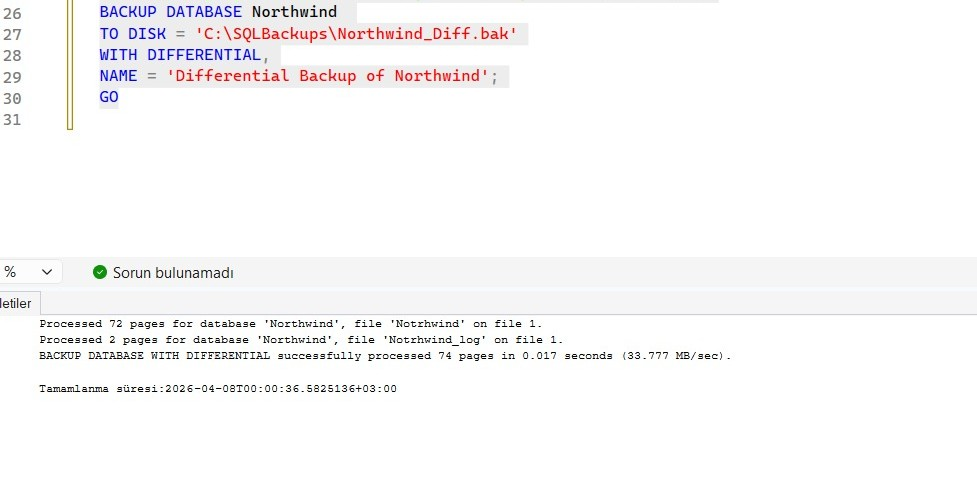

### 2.3 İşlem Günlüğü Yedekleme (Transaction Log Backup / Artık Yedekleme)
Belirli bir zamana (Point-in-Time) dönüş yapabilmek için son log yedeğinden itibaren yapılan işlemleri kaydeder. Sadece "Full Recovery Model" altında çalışır. 

```sql
SELECT 
d.name AS DatabaseName,
d.state_desc AS Status,
d.recovery_model_desc AS RecoveryModel
FROM sys.databases d
WHERE d.name = 'Northwind';
```
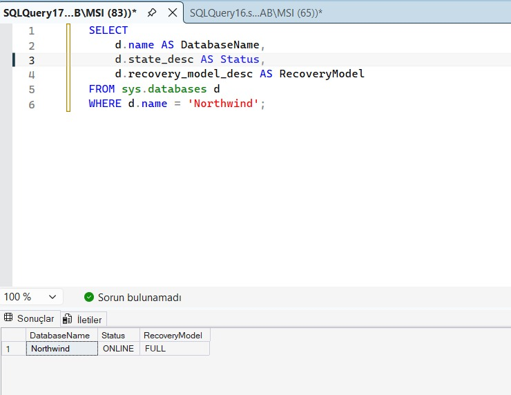

```sql

BACKUP LOG Northwind 
TO DISK = 'C:\SQLBackups\Northwind_Log.trn'
WITH NAME = 'Transaction Log Backup of Northwind';
GO
```

---

tüm yedeklemelerin yapıldığını gösteren sql sorgusu:

```sql
SELECT TOP 10
    bs.database_name AS veritabaniAdi, 
    bs.backup_start_date AS yedekBaslangic, 
    bs.backup_finish_date AS yedekBitis, 
    bs.type AS yedekTipi, 
    bs.backup_size AS yedekBoyutuMB,
    bmf.physical_device_name AS yedekDosyaYolu
FROM msdb.dbo.backupset bs
INNER JOIN msdb.dbo.backupmediafamily bmf
   ON bs.media_set_id = bmf.media_set_id
WHERE bs.database_name = 'Northwind'
ORDER BY bs.backup_finish_date DESC;

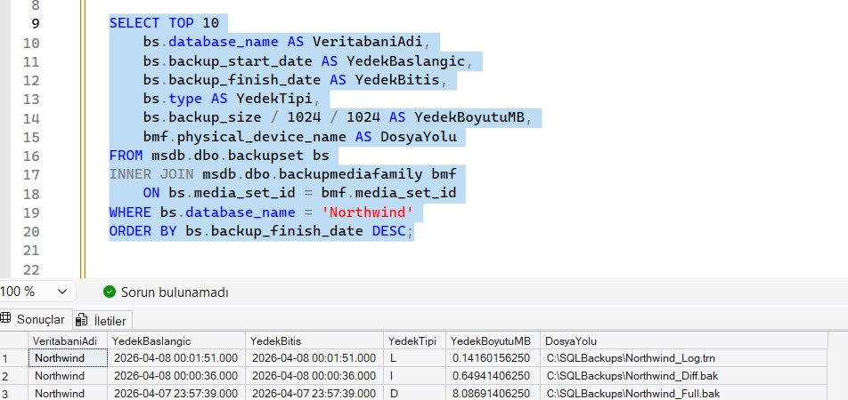

```

## 3. Zamanlayıcılarla Otomatik Yedekleme

İlgili `.sql` dosyası: `02_Scheduled_Backups.sql`

Yedekleme stratejilerinin manuel yürütülmesi veri kaybı riskini barındırır. Bu çalışmada `SQL Server Agent` kullanılarak günlük tam yedeklerin otomize edilmesi sağlanmıştır.

1. Özel bir Görev (Job) oluşturulur.
```sql

EXEC dbo.sp_add_job 
    @job_name = N'Northwind_Daily_Full_Backup',
    @enabled = 1,
    @description = N'Northwind veritabanı için günlük otomatik tam yedekleme görevi.';
GO

```

2. Bu Job'ın içine `BACKUP DATABASE` komutu adım ("step") olarak eklenir.

```sql

EXEC sp_add_jobstep 
    @job_name = N'Northwind_Daily_Full_Backup', 
    @step_name = N'Execute Full Backup', 
    @subsystem = N'TSQL', 
    @command = N'BACKUP DATABASE Northwind TO DISK = ''C:\SQLBackups\Northwind_Daily.bak'' WITH INIT', 
    @retry_attempts = 3, 
    @retry_interval = 5;
GO

```

3. Zamanlayıcı (Örn: Her gece saat 02:00) ayarlanarak oluşturulan Görev'e bağlanır.

```sql
-- Zamanlayıcı oluşturma
EXEC sp_add_schedule 
    @schedule_name = N'Daily_2AM_Schedule', 
    @freq_type = 4,         -- Günlük (Daily)
    @freq_interval = 1,     -- Her gün (Every 1 day)
    @active_start_time = 020000; -- Saat 02:00:00
GO

-- Göreve bağlama

EXEC sp_attach_schedule 
    @job_name = N'Northwind_Daily_Full_Backup', 
    @schedule_name = N'Daily_2AM_Schedule';
GO

```
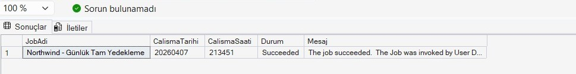

---

## 4. Felaketten Kurtarma Senaryosu

İlgili `.sql` dosyası: `03_Disaster_Recovery_Scenario.sql`


ilk olarak test tablosu oluşturuyoruz. Felaket kurtarma senaryosunu test edebilmek amacıyla `Table_RecoveryTest` adında bir test tablosu oluşturduk. Bu tablo, veri ekleme ve silme işlemlerini simüle ederek geri yükleme sürecinin doğruluğunu test etmek için kullanılacaktır.

```sql

CREATE TABLE Table_RecoveryTest (
    Id INT IDENTITY(1,1) PRIMARY KEY,
    Data NVARCHAR(100),
    CreatedAt DATETIME DEFAULT GETDATE()
);


```


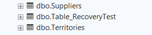


Test senaryosu kapsamında ikinci olarak tablomuza verileri ekliyoruz. Bu veriler, felaket sonrası geri yükleme işleminin doğruluğunu test etmek amacıyla kullanılacaktır.

```sql

INSERT INTO Table_RecoveryTest (Data) 
VALUES 
('Onemli Musteri Verisi 1'),
('Onemli Siparis Verisi 2'),
('Kritik Finans Verisi');


```
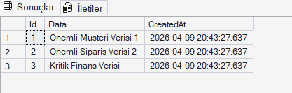


Verilerin güvenli bir noktası oluşturmak amacıyla veritabanının tam yedeği(full backup) alınmıştır. Bu yedek, felaket sonrası geri dönüş için temel referans noktası olarak kullanılacaktır.

```sql

BACKUP DATABASE Northwind 
TO DISK = 'C:\SQLBackups\Northwind_Full.bak'
WITH INIT, NAME = 'Full Backup Before Disaster';

```

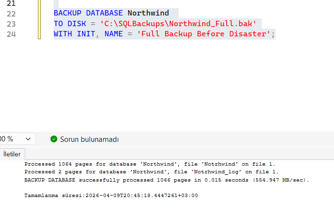


Verilerin henüz silinmediği anın zaman bilgisi kaydedilmiştir. Bu zaman bilgisi, point-in-time restore işlemi sırasında kullanılacaktır.

```sql

SELECT GETDATE() AS CurrentTime;

```
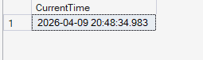

Felaket senaryosu kapsamında, kritik verilerden biri yanlışlıkla silinmiş gibi simüle edilmiştir. Bu işlem, gerçek hayatta kullanıcı hatası sonucu oluşabilecek veri kaybını temsil etmektedir.
 
```sql

DELETE FROM Table_RecoveryTest
WHERE Data = 'Onemli Musteri Verisi 1';

```
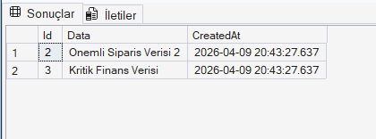


Veri kaybını minimuma indirmek amacıyla Tail-Log Backup alınmıştır. Bu işlem, veritabanının kapanmadan önceki son transaction kayıtlarını koruyarak geri yükleme zincirine dahil edilmesini sağlar.

 
```sql

BACKUP LOG Northwind
TO DISK = 'C:\SQLBackups\Northwind_Tail_Log.trn'
WITH NORECOVERY;

```
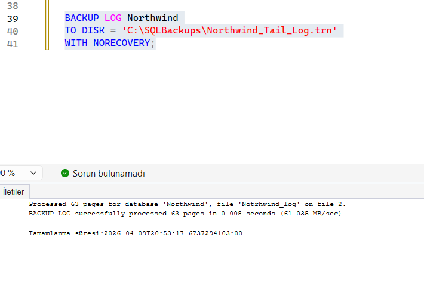


Veritabanı geri yükleme işlemi restore zinciri mantığına uygun şekilde gerçekleştirilmiştir. İlk olarak tam yedek geri yüklenmiş ve veritabanı NORECOVERY modunda bırakılmıştır. Ardından transaction log yedeği kullanılarak veritabanı, veri kaybı yaşanmadan önceki zamana geri getirilmiştir.

```sql
-- 1. Tam Yedeği NORECOVERY ile geri yükleme
RESTORE DATABASE Northwind 
FROM DISK = 'C:\SQLBackups\Northwind_Full.bak' 
WITH NORECOVERY, REPLACE;
GO

-- 2. Log yedeğini belirli bir zamana (STOPAT) kadar geri yükleme
RESTORE LOG Northwind 
FROM DISK = 'C:\SQLBackups\Northwind_Tail_Log.trn'
WITH STOPAT = '2026-04-09 20:53:17',
RECOVERY;
GO
```


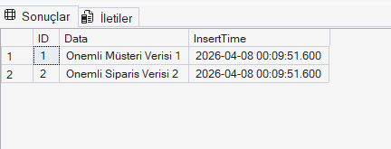

Geri yükleme işlemi tamamlandıktan sonra yapılan kontrollerde silinen verinin başarıyla geri getirildiği gözlemlenmiştir. Bu durum, point-in-time restore işleminin doğru şekilde çalıştığını göstermektedir.


## 5. Yedeklerin Test Edilmesi

İlgili `.sql` dosyası: `04_Test_Restore.sql`

Alınan yedeklerin güvenilirliği ve sağlamlığı kriz anından önce periyodik olarak test edilmelidir.
*   **RESTORE VERIFYONLY:** Veritabanına fiziksel veya mantıksal bir zarar gelip gelmediğini, dosyaların sağlamlığını verileri geri yüklemeden test eder.
```sql

RESTORE VERIFYONLY FROM DISK = 'C:\SQLBackups\Northwind_Full.bak';
```
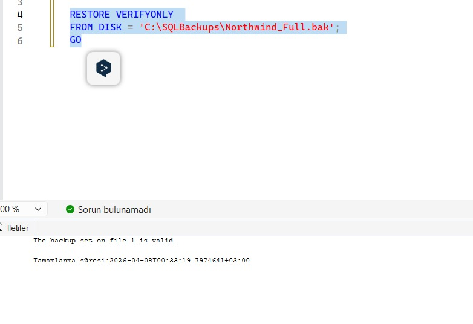

*   **Side-by-side Restore (Yan Yana Geri Yükleme):** Üretim ortamını tehlikeye atmadan yedeğin işlevselliğini %100 kanıtlamak adına yedek dosyasından (`.bak`) geçici bir test veritabanı kurulur ve çalıştırılır.
```sql

RESTORE DATABASE Northwind_TestRestore 
FROM DISK = 'C:\SQLBackups\Northwind_Full.bak'
WITH 
    MOVE 'Northwind' TO 'C:\SQLBackups\Northwind_Test_Data.mdf',
    MOVE 'Northwind_log' TO 'C:\SQLBackups\Northwind_Test_Log.ldf',
    RECOVERY;
GO
```
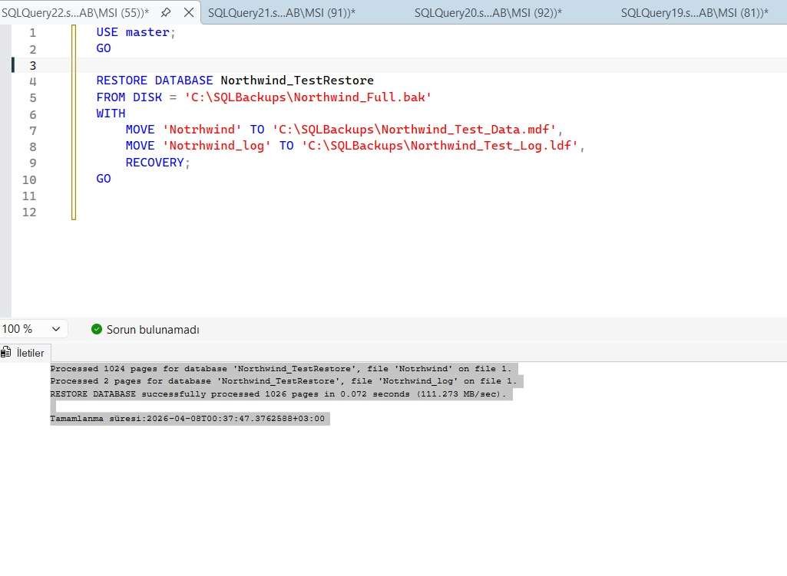

---

## 6. Sonuç
Proje boyunca, SQL Server üzerinde `Northwind` veritabanı ile Felaketten Kurtarma planı kurgulanmış, senaryolaştırılmış ve test edilmiştir. 
Uygulamalı adımlarla tam ve fark yedekleri alınmış, Agent kullanılarak operasyonel süreç otomatikleştirilmiştir. En önemlisi olan Point-in-Time restorasyon süreci ile, felaket (veya insan hatası) meydana geldiğinde tüm verilerin spesifik bir dakikaya başarıyla geri çekilebileceği kanıtlanmıştır. Doğru kurgulanmış bu stratejiler kurumsal verilerin hayatiliğini güvence altında tutmayı başarmıştır.
