# BLM4522 – Ağ Tabanlı Paralel Dağıtım Sistemleri  
## Proje 7: Veritabanı Yedekleme ve Otomasyon Çalışması
 
**Öğrenci Adı:** [Özge Taraşlı]  
**Öğrenci No:** [21290755]  
**Platform:** Microsoft SQL Server (SSMS)  
**Veritabanı:** Northwind  
**Video:** []
 
---
 
## İçindekiler
 
1. [Giriş ve Amaç](#1-giriş-ve-amaç)  
2. [Kullanılan Ortam](#2-kullanılan-ortam)  
3. [Yedekleme Stratejisi Tasarımı](#3-yedekleme-stratejisi-tasarımı)  
4. [Ortam Hazırlığı ve Recovery Model Ayarı](#4-ortam-hazırlığı-ve-recovery-model-ayarı)  
5. [Yedekleme Klasörlerinin Oluşturulması](#5-yedekleme-klasörlerinin-oluşturulması)  
6. [Manuel Yedekleme Testleri](#6-manuel-yedekleme-testleri)  
   - 6.1 Full Backup  
   - 6.2 Differential Backup  
   - 6.3 Transaction Log Backup  
7. [SQL Server Agent ile Otomasyon](#7-sql-server-agent-ile-otomasyon)  
   - 7.1 Agent Durumu Kontrolü  
   - 7.2 Full Backup Job  
   - 7.3 Differential Backup Job  
   - 7.4 Log Backup Job  
   - 7.5 Job'ların Manuel Tetiklenmesi ve Test  
8. [T-SQL Raporlama Sorguları](#8-t-sql-raporlama-sorguları)  
9. [Otomatik Uyarı Sistemi – Database Mail](#9-otomatik-uyarı-sistemi--database-mail)  
   - 9.1 Database Mail Kurulumu  
   - 9.2 Operator Tanımlama  
   - 9.3 Alert Tanımlama  
   - 9.4 Başarısız Backup Simülasyonu  
10. [Sonuç ve Değerlendirme](#10-sonuç-ve-değerlendirme)
---
 
## 1. Giriş ve Amaç
 
Bu proje kapsamında Microsoft SQL Server üzerinde çalışan **Northwind** örnek veritabanı için kapsamlı bir yedekleme ve otomasyon altyapısı tasarlanmış ve uygulanmıştır.
 
Projenin temel hedefleri şunlardır:
 
- Tam (Full), Fark (Differential) ve İşlem Günlüğü (Transaction Log) yedekleme stratejilerini oluşturmak
- SQL Server Agent ile yedekleme işlemlerini belirli zaman aralıklarında otomatik hale getirmek
- T-SQL sorguları ve `msdb` sistem veritabanı üzerinden yedekleme geçmişini raporlamak.Yani backup geçmiş bilgilerini, T-SQL sorguları yazarak msdb içinden çekmek
- Başarısız yedekleme senaryolarında yöneticiye otomatik e-posta bildirimi gönderecek bir uyarı mekanizması kurmak
Veritabanı yönetiminde yedekleme ve felaketten kurtarma süreçleri, iş sürekliliği açısından kritik öneme sahiptir. Bu proje, söz konusu süreçlerin hem manuel hem de otomatik boyutlarını kapsamaktadır.
 
---
 
## 2. Kullanılan Ortam
 
| Bileşen | Detay |
|---|---|
| İşletim Sistemi | Windows 11 |
| Veritabanı Yönetim Sistemi | Microsoft SQL Server 2022 |
| Yönetim Arayüzü | SQL Server Management Studio (SSMS) |
| Veritabanı | Northwind (örnek veritabanı) |
| Yedek Depolama Yolu | `C:\Backups\Northwind\` |
| Bildirim Sistemi | Database Mail (SMTP) |

Aşağıdaki sorgu ile veritabanımızın doğru ve var olduğunu doğruladık; aynı zamanda hangi recovery model'de olduğunu kontrol ettik. Yedekleme işlemleri için veritabanının FULL recovery model'de çalışması gerekmektedir.

```sql
SELECT 
    name,
    state_desc,
    recovery_model_desc
FROM sys.databases
WHERE name = 'Northwind';
```
Eğer recovery_model_desc değeri SIMPLE ise aşağıdaki komut ile FULL olarak değiştirilebilir. Bizim ortamımızda veritabanı zaten FULL model'de olduğu için bu adım uygulanmamıştır.

```sql
USE master;
ALTER DATABASE Northwind SET RECOVERY FULL;

-- Doğrula
SELECT name, recovery_model_desc 
FROM sys.databases 
WHERE name = 'Northwind';
```
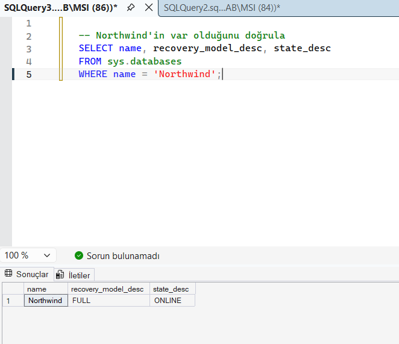

*Şekil 1: Northwind veritabanı durum ve recovery model sorgusu*

## 3. Yedekleme Stratejisi Tasarımı
 
Projede üç katmanlı bir yedekleme stratejisi benimsenmiştir:
 
| Yedekleme Türü | Açıklama | Zamanlama |
|---|---|---|
| **Full Backup** | Veritabanının tamamını yedekler | Her gece 00:00 |
| **Differential Backup** | Son Full'dan bu yana değişen blokları yedekler | Her 4 saatte bir |
| **Transaction Log Backup** | Son Log backup'tan bu yana gerçekleşen işlemleri yedekler | Her saat başı |
 
Bu strateji; depolama alanı kullanımını optimize ederken, herhangi bir veri kaybı durumunda en güncel noktaya kadar geri dönebilme (Point-in-Time Recovery) imkânı sunar.
 
---

## 4. Yedekleme Klasörlerinin Oluşturulması
 
Farklı yedek türleri için ayrı klasörler oluşturulmuştur. Bu klasörler Windows Explorer üzerinden manuel olarak veya SSMS üzerinden aşağıdaki komutla oluşturulabilir.Biz projemizde windowa Explorer üzerinden klasörleri oluşturduk.

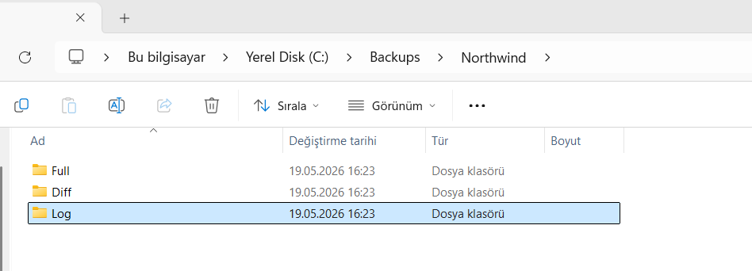

*Şekil 2: Yedekleme klasörleri*

## 5. Manuel Yedekleme Testleri
 
Otomasyona geçmeden önce üç yedekleme türünün doğru çalıştığını doğrulamak amacıyla manuel testler gerçekleştirilmiştir.
 
### 5.1 Full Backup
 
```sql
BACKUP DATABASE Northwind
TO DISK = 'C:\Backups\Northwind\Full\Northwind_Full.bak'
WITH 
    FORMAT,
    NAME = 'Northwind Full Backup',
    STATS = 10;
```

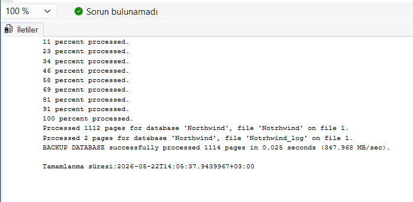

*Şekil 3: Full Backup*

### 5.2 Differential Backup

```sql
BACKUP DATABASE Northwind
TO DISK = 'C:\Backups\Northwind\Diff\Northwind_Diff.bak'
WITH 
    DIFFERENTIAL,
    NAME = 'Northwind Differential Backup',
    STATS = 10;
```

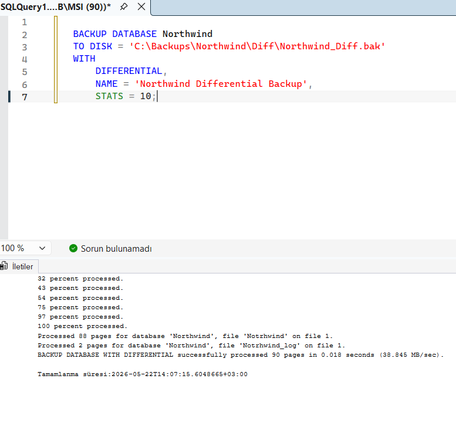

*Şekil 4: Differential Backup*

### 5.3 Transaction Log Backup

```sql
BACKUP LOG Northwind
TO DISK = 'C:\Backups\Northwind\Log\Northwind_Log.trn'
WITH 
    NAME = 'Northwind Transaction Log Backup',
    STATS = 10;
```
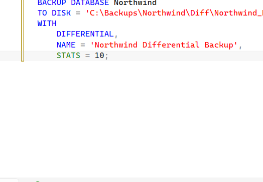

*Şekil 5: Transaction Log Backup*

## 6. SQL Server Agent ile Otomasyon
 
### 6.1 Agent Durumu Kontrolü
 
SQL Server Agent, zamanlanmış görevlerin yönetildiği servistir. SSMS → Object Explorer penceresinde sol altta görünmelidir. Kırmızı ✕ işareti varsa sağ tıklanarak **Start** seçilmelidir.Daha sonrasında Object Explorer'da SQL Server Agent'ın aktif (yeşil ok) görülücektir.

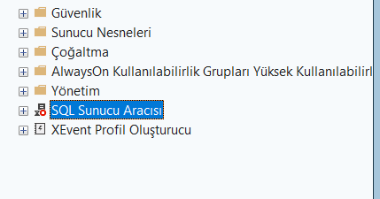
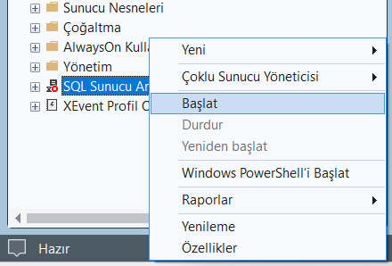
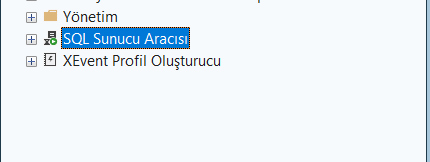

*Şekil 8: SQL Server Agentin aktif hali*


### 6.2 Full Backup Job (Gece 00:00)
 
```sql
USE msdb;
GO
 
-- Job oluştur
EXEC sp_add_job
    @job_name = N'Northwind_Full_Backup_Job';
 
-- Job adımı ekle
EXEC sp_add_jobstep
    @job_name = N'Northwind_Full_Backup_Job',
    @step_name = N'Full Backup Step',
    @command = N'BACKUP DATABASE Northwind
TO DISK = ''C:\Backups\Northwind\Full\Northwind_Full_'' 
           + CONVERT(VARCHAR, GETDATE(), 112) + ''.bak''
WITH FORMAT, NAME = ''Northwind Nightly Full Backup'', STATS = 10;';
 
-- Zamanlama oluştur (her gece 00:00)
EXEC sp_add_schedule
    @schedule_name  = N'Daily_Midnight',
    @freq_type      = 4,
    @freq_interval  = 1,
    @active_start_time = 000000;
 
-- Zamanlamayı job'a bağla
EXEC sp_attach_schedule
    @job_name      = N'Northwind_Full_Backup_Job',
    @schedule_name = N'Daily_Midnight';
 
-- Job'u sunucuya kaydet
EXEC sp_add_jobserver
    @job_name = N'Northwind_Full_Backup_Job';
```
 
---

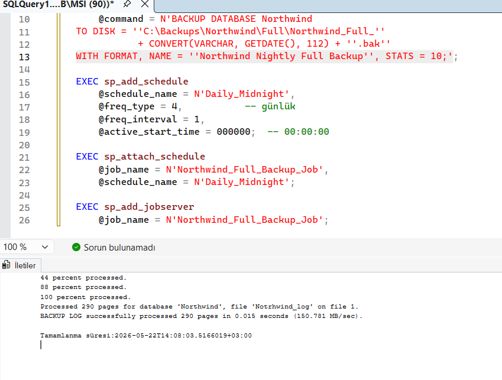

*Şekil 9: Full Backup Jobun başarılı şekilde çalışması*

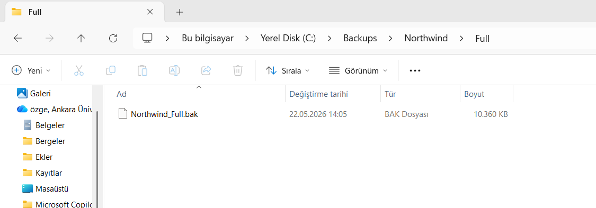

*Şekil 10: Full Backup Jobun oluşturduğu yedek dosyası*

 
### 6.3 Differential Backup Job (Her 4 Saatte Bir)
 
```sql
EXEC sp_add_job
    @job_name = N'Northwind_Diff_Backup_Job';
 
EXEC sp_add_jobstep
    @job_name = N'Northwind_Diff_Backup_Job',
    @step_name = N'Differential Backup Step',
    @command = N'BACKUP DATABASE Northwind
TO DISK = ''C:\Backups\Northwind\Diff\Northwind_Diff_''
           + CONVERT(VARCHAR, GETDATE(), 112) + ''_''
           + REPLACE(CONVERT(VARCHAR, GETDATE(), 108),'':'','''') + ''.bak''
WITH DIFFERENTIAL, NAME = ''Northwind Diff Backup'', STATS = 10;';
 
EXEC sp_add_schedule
    @schedule_name       = N'Every4Hours',
    @freq_type           = 4,
    @freq_interval       = 1,
    @freq_subday_type    = 8,
    @freq_subday_interval = 4;
 
EXEC sp_attach_schedule
    @job_name      = N'Northwind_Diff_Backup_Job',
    @schedule_name = N'Every4Hours';
 
EXEC sp_add_jobserver
    @job_name = N'Northwind_Diff_Backup_Job';
```
 
---
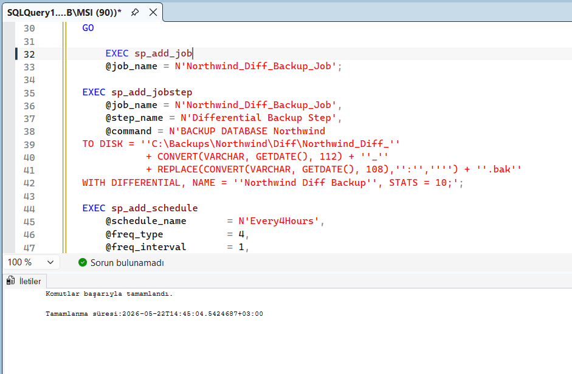

*Şekil 11: Differential Backup Jobun başarılı şekilde çalışması*

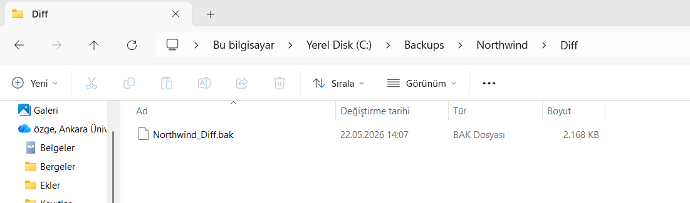

*Şekil 12: Differential Backup Jobun oluşturduğu yedek dosyası*

### 6.4 Log Backup Job (Her Saat Başı)
 
```sql
EXEC sp_add_job
    @job_name = N'Northwind_Log_Backup_Job';
 
EXEC sp_add_jobstep
    @job_name = N'Northwind_Log_Backup_Job',
    @step_name = N'Log Backup Step',
    @command = N'BACKUP LOG Northwind
TO DISK = ''C:\Backups\Northwind\Log\Northwind_Log_''
           + CONVERT(VARCHAR, GETDATE(), 112) + ''_''
           + REPLACE(CONVERT(VARCHAR, GETDATE(), 108),'':'','''') + ''.bak''
WITH NAME = ''Northwind Log Backup'', STATS = 10;';
 
EXEC sp_add_schedule
    @schedule_name       = N'EveryHour',
    @freq_type           = 4,
    @freq_interval       = 1,
    @freq_subday_type    = 8,
    @freq_subday_interval = 1;
 
EXEC sp_attach_schedule
    @job_name      = N'Northwind_Log_Backup_Job',
    @schedule_name = N'EveryHour';
 
EXEC sp_add_jobserver
    @job_name = N'Northwind_Log_Backup_Job';

```
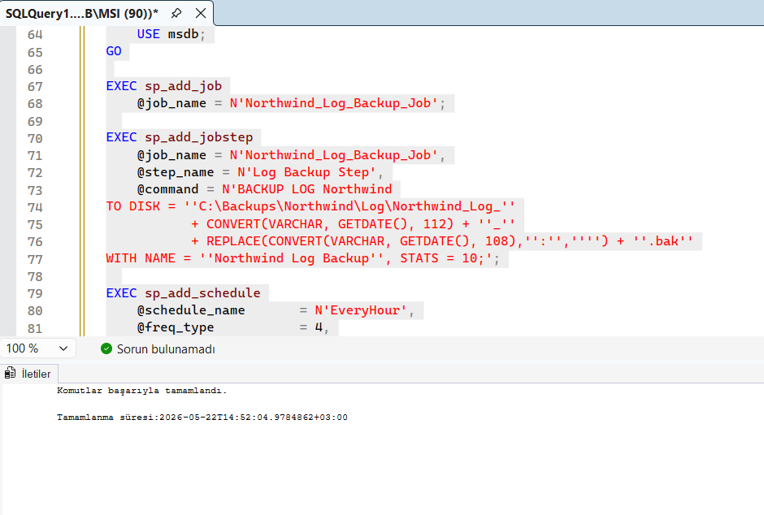

*Şekil 13: Log Backup Jobun başarılı şekilde çalışması*

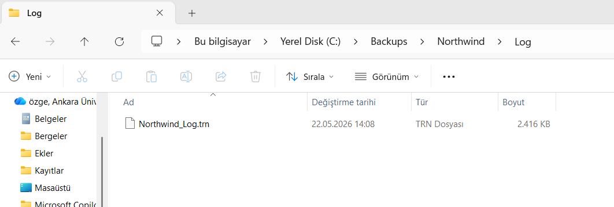

*Şekil 14: Log Backup Jobun oluşturduğu yedek dosyası*

SQL Server Job altından jobs kısmından oluşturduğumuz tüm jobları görebiliriz.

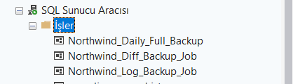

*Şekil 15: Tüm Jobların başarılı şekilde oluşturulması*


### 6.5 Job'ların Manuel Tetiklenmesi ve Test
 
Oluşturulan job'lar zamanlamayı beklemeden aşağıdaki komutlarla manuel olarak tetiklenmiş ve sonuçları doğrulanmıştır:
 
```sql
EXEC msdb.dbo.sp_start_job N'Northwind_Full_Backup_Job';
EXEC msdb.dbo.sp_start_job N'Northwind_Diff_Backup_Job';
EXEC msdb.dbo.sp_start_job N'Northwind_Log_Backup_Job';
```
 
Job çalıştıktan birkaç saniye sonra aşağıdaki sorgu ile sonuçlar kontrol edilmiştir:
 
```sql
SELECT 
    j.name AS JobName,
    h.run_date,
    h.run_time,
    CASE h.run_status 
        WHEN 0 THEN 'Başarısız'
        WHEN 1 THEN 'Başarılı'
        WHEN 2 THEN 'Yeniden Deneniyor'
        WHEN 3 THEN 'İptal Edildi'
    END AS Status,
    h.message
FROM msdb.dbo.sysjobhistory h
JOIN msdb.dbo.sysjobs j ON h.job_id = j.job_id
WHERE j.name LIKE 'Northwind%'
ORDER BY h.run_date DESC, h.run_time DESC;
```

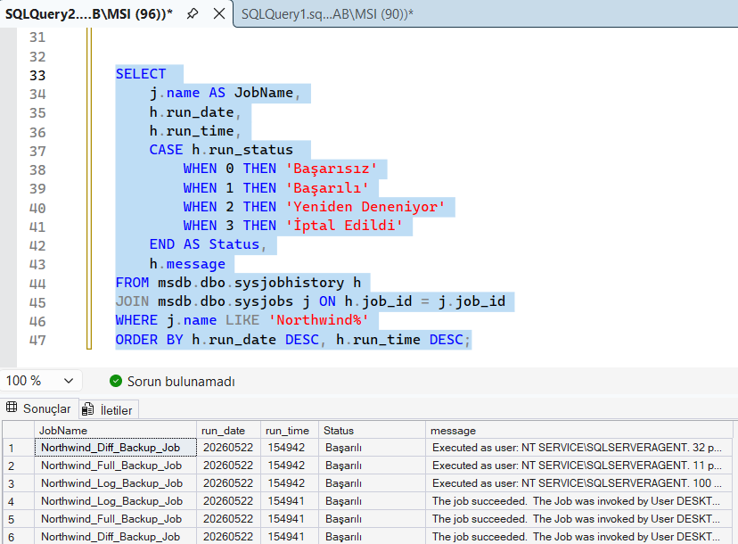

*Şekil 16: Tüm Jobların manuel tetiklenmesi ve test sonuc başarılı olma durumları*


## 7. T-SQL Raporlama Sorguları
 
Yedekleme geçmişi `msdb` sistem veritabanındaki `backupset` ve `backupmediafamily` tabloları üzerinden sorgulanmıştır. Bu raporlama, hangi yedeklerin ne zaman alındığını, ne kadar sürdüğünü ve dosya boyutlarını göstermektedir.
 
```sql
SELECT 
    bs.database_name                                              AS DatabaseName,
    CASE bs.type
        WHEN 'D' THEN 'Full'
        WHEN 'I' THEN 'Differential'
        WHEN 'L' THEN 'Log'
    END                                                           AS BackupType,
    bs.backup_start_date                                          AS StartTime,
    bs.backup_finish_date                                         AS FinishTime,
    DATEDIFF(SECOND, bs.backup_start_date, bs.backup_finish_date) AS DurationSeconds,
    CAST(bs.backup_size / 1024.0 / 1024.0 AS DECIMAL(10,2))      AS SizeMB,
    bmf.physical_device_name                                      AS BackupFilePath
FROM msdb.dbo.backupset        bs
JOIN msdb.dbo.backupmediafamily bmf ON bs.media_set_id = bmf.media_set_id
WHERE bs.database_name = 'Northwind'
ORDER BY bs.backup_start_date DESC;
```
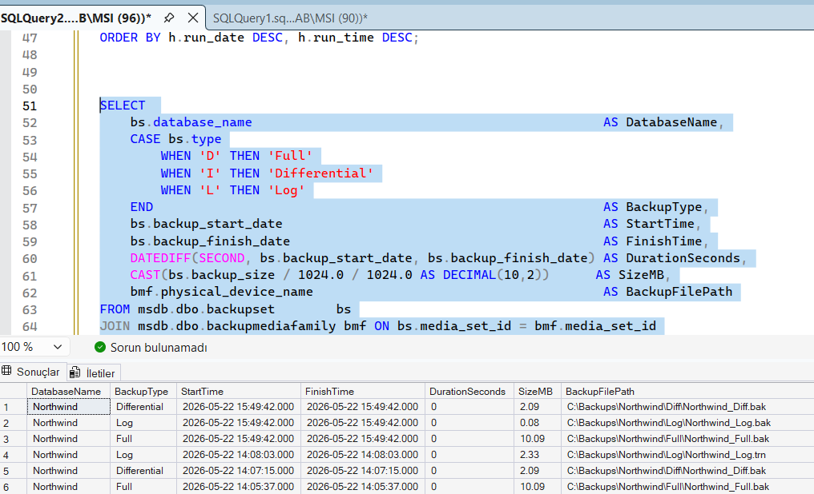

*Şekil 18: Full, Differential, Log satırlarının hepsinin göründüğü tablo*


## 8. Otomatik Uyarı Sistemi – Database Mail
 
### 8.1 Database Mail Kurulumu
 
Database Mail, SSMS üzerinden **Management → Database Mail** sağ tıklanarak **Configure Database Mail** seçeneği ile yapılandırılmıştır.
 
Yapılandırma adımları:
 
1. **Set up Database Mail** seçildi → Next
2. **Profile Name:** `BackupAlerts` olarak girildi
3. **SMTP Account** eklendi:
   - Server Name: `smtp.gmail.com`
   - Port: `587`
   - SSL: Enabled
   - Authentication: Gmail App Password ile
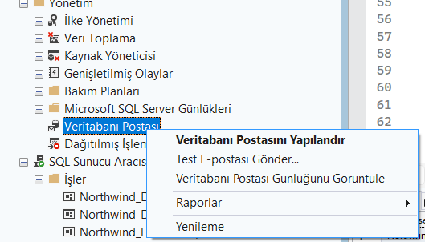

*Şekil 19: Database Mail yapılandırma sihirbazının tamamlandığı ekran görüntüsü*

Test maili gönderilmiştir:
 
```sql
EXEC msdb.dbo.sp_send_dbmail
    @profile_name = 'BackupAlerts',
    @recipients   = [EMAIL_ADDRESS]',
    @subject      = 'Test – Backup Uyarı Sistemi Aktif',
    @body         = 'Database Mail başarıyla çalışıyor. Northwind yedekleme uyarı sistemi devrededir.';
```
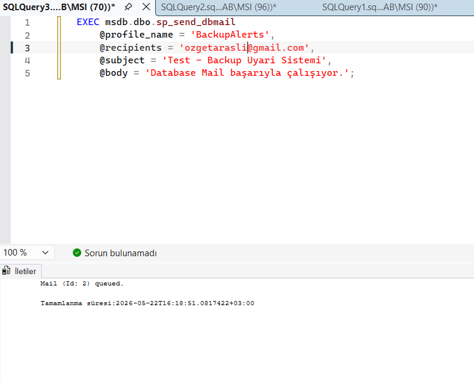
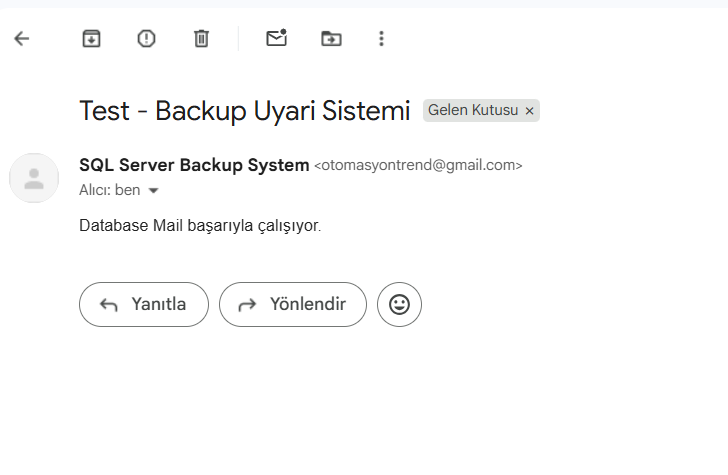

*Şekil 20: Test mailinin başarıyla çalışıp gönderildiği doğrulanmıştır*

### 8.2 Operator Tanımlama
 
```sql
EXEC msdb.dbo.sp_add_operator
    @name          = N'DBAdmin',
    @email_address = [EMAIL_ADDRESS]';
```
 
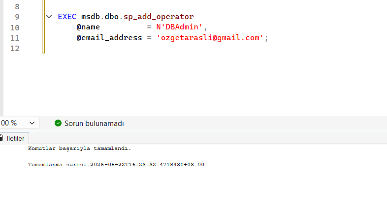
*Şekil 22: Operatörün başarıyla tanımlandığını gösteren ekran görüntüsü*

### 8.3 Alert Tanımlama
 
SQL Server Error 3041, yedekleme hatalarında üretilen sistem hatasıdır. Bu hata için bir Alert tanımlanmış ve DBAdmin operatörüne bildirim bağlanmıştır:
 
```sql
-- Alert oluştur
EXEC msdb.dbo.sp_add_alert
    @name                 = N'Backup Failure Alert',
    @message_id           = 3041,
    @severity             = 0,
    @notification_message = N'Northwind yedekleme işlemi başarısız oldu! Lütfen kontrol ediniz.';
 
-- Operatöre bildirim bağla
EXEC msdb.dbo.sp_add_notification
    @alert_name         = N'Backup Failure Alert',
    @operator_name      = N'DBAdmin',
    @notification_method = 1;  -- 1 = E-posta
```


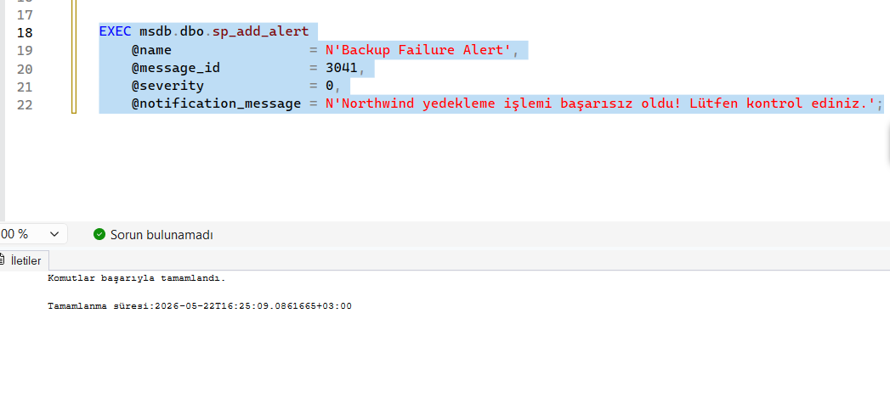
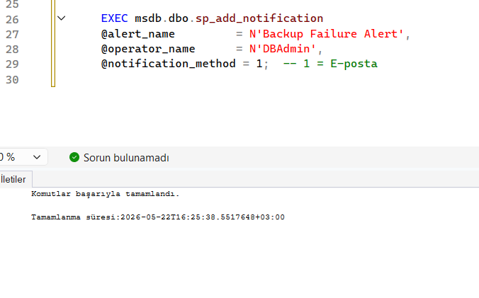

*Şekil 23: Alert tanımının başarıyla tamamlandığını gösteren ekran görüntüsü*


### 8.4 Başarısız Backup Simülasyonu

Uyarı sisteminin çalıştığını doğrulamak için geçersiz bir path içeren bir test job'u oluşturulmuş ve Agent üzerinden çalıştırılmıştır. Alert yalnızca SQL Server Agent kaynaklı hataları yakaladığından testin Agent üzerinden yapılması gerekmektedir.

```sql
USE msdb;

EXEC sp_add_job @job_name = N'Northwind_Backup_Fail_Test';

EXEC sp_add_jobstep
    @job_name  = N'Northwind_Backup_Fail_Test',
    @step_name = N'Fail Step',
    @command   = N'BACKUP DATABASE Northwind
TO DISK = ''Z:\GecersizKlasor\test.bak''
WITH FORMAT;';

EXEC sp_add_jobserver @job_name = N'Northwind_Backup_Fail_Test';
```
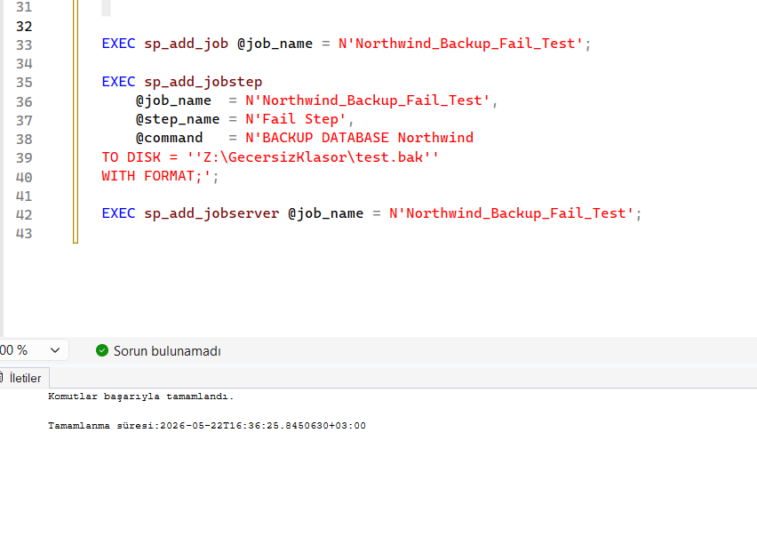
```sql
EXEC msdb.dbo.sp_start_job N'Northwind_Backup_Fail_Test';
```
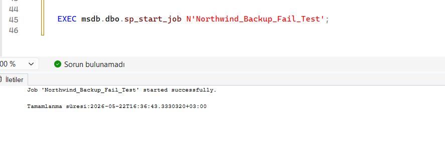

Job Agent tarafından çalıştırılmış, geçersiz path nedeniyle Error 3041 üretilmiştir. Tanımlı Alert devreye girerek DBAdmin operatörüne otomatik e-posta bildirimi gönderilmiştir.


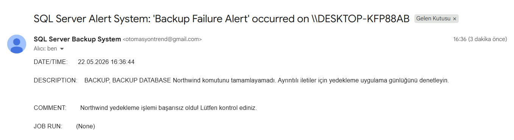


## 9. Sonuç ve Değerlendirme
 
Bu proje kapsamında Northwind veritabanı için uçtan uca bir yedekleme ve otomasyon altyapısı başarıyla kurulmuştur.
 
**Gerçekleştirilen Çalışmaların Özeti:**
 
| Bölüm | Yapılan İşlem | Sonuç |
|---|---|---|
| Recovery Model | FULL olarak ayarlandı | Log backup aktif hale geldi |
| Manuel Yedekleme | Full, Differential, Log backup alındı | Tüm yedekler başarılı |
| SQL Server Agent | 3 ayrı otomatik job kuruldu | Zamanlamalar aktif |
| T-SQL Raporlama | Yedekleme geçmişi sorgulandı | Raporlar doğrulandı |
| Database Mail | SMTP ile e-posta sistemi kuruldu | Test maili iletildi |
| Alert Sistemi | Error 3041 için uyarı tanımlandı | Hata simülasyonunda mail gönderildi |
 
**Öğrenilen Kavramlar:**
 
Proje sürecinde Full/Differential/Log yedekleme türleri arasındaki farklar, Recovery Model'in Transaction Log Backup üzerindeki etkisi, SQL Server Agent ile görev zamanlama mekanizması ve `msdb` sistem veritabanının yedekleme denetimindeki rolü gibi konular uygulamalı olarak pekiştirilmiştir.
 
 