# Veritabanı Performans Optimizasyonu ve İzleme

**Ders:** Veritabanı Yönetimi
**Proje:** Veritabanı Performans Optimizasyonu ve İzleme
**Veritabanı:** Northwind
**Araçlar:** SQL Server Management Studio (SSMS), SQL Server DMV'leri, Execution Plan
**Tarih:** Haziran 2026

---

# İçindekiler

1. Giriş ve Amaç
2. Kullanılan Ortam
3. Veritabanı İzleme (DMV)
4. İndeks Yönetimi
5. Sorgu Optimizasyonu ve Execution Plan
6. Veri Yöneticisi Rolleri ve Erişim Yönetimi
7. Sonuç ve Değerlendirme

---

# 1. Giriş ve Amaç

Bu projede Microsoft SQL Server üzerinde çalışan Northwind veritabanı kullanılarak performans analizi ve optimizasyon çalışmaları gerçekleştirilmiştir.

Çalışmanın amacı;

* Veritabanı performansını izlemek,
* Kaynak tüketen sorguları belirlemek,
* İndeks kullanımını analiz etmek,
* Eksik veya gereksiz indeksleri tespit etmek,
* Sorguları optimize etmek,
* Kullanıcı ve rol bazlı erişim yönetimini incelemektir.

Bu amaçla SQL Server Dynamic Management Views (DMV), Execution Plan ve çeşitli sistem görünümlerinden yararlanılmıştır.

---

# 2. Kullanılan Ortam

| Bileşen                    | Açıklama                     |
| -------------------------- | ---------------------------- |
| Veritabanı                 | Northwind                    |
| Veritabanı Yönetim Sistemi | SQL Server                   |
| Yönetim Aracı              | SQL Server Management Studio |
| Performans Analizi         | DMV                          |
| Sorgu Analizi              | Execution Plan               |
| Güvenlik Yönetimi          | Login, User, Role            |

---

# 3. Veritabanı İzleme (DMV ve SQL Profiler)

## 3.1 Veritabanı Genel Bilgileri

İlk olarak sistemin çalıştığı SQL Server sürümü ve veritabanı bilgileri incelenmiştir.

```sql
USE Northwind;

SELECT
    DB_NAME() AS DatabaseName,
    @@SERVERNAME AS ServerName,
    @@VERSION AS SQLVersion;
```

### Açıklama

Bu sorgu;

* Kullanılan veritabanını,
* SQL Server sunucusunu,
* SQL Server sürümünü

öğrenmek amacıyla çalıştırılmıştır.

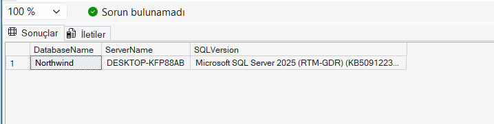

---

## 3.2 Tablo ve Kayıt Sayıları

```sql
SELECT
    t.NAME AS TableName,
    p.rows AS RowCount
FROM sys.tables t
JOIN sys.partitions p
ON t.object_id = p.object_id
WHERE p.index_id IN (0,1)
ORDER BY p.rows DESC;
```

### Açıklama

Veritabanındaki tabloların büyüklüklerini görmek için kullanılmıştır.

Büyük tablolarda yapılacak sorgular performansı daha fazla etkileyebileceğinden tablo yoğunluğu analiz edilmiştir.

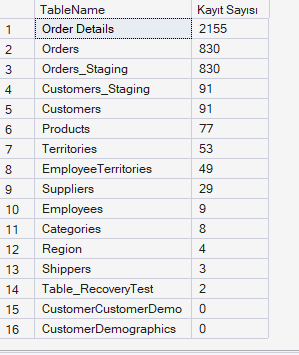

Yapılan sorgu sonucunda Northwind veritabanındaki en yoğun tablolar sırasıyla Order Details (2155 satır) ve Orders (830 satır) tablolarıdır. Performans optimizasyonu ve indeksleme çalışmalarının veritabanındaki en büyük tablo olan ve sipariş detaylarını tutan Order Details ile ilişkili olduğu Orders tablosu üzerinde yoğunlaştırılması gerektiği sayısal olarak doğrulanmıştır. Boyutu küçük olan (Örn: Shippers - 3 satır, Region - 4 satır) tablolarda indeksleme yapmak yerine, bu yoğun tablolarda yapılacak optimizasyonlar sistem genelinde çok daha yüksek performans artışı sağlayacaktır.

---

## 3.3 Aktif Sorguların İzlenmesi

```sql
SELECT
    r.session_id,
    r.status,
    r.command,
    r.cpu_time,
    r.total_elapsed_time,
    SUBSTRING(t.text,1,200) AS QueryText
FROM sys.dm_exec_requests r
CROSS APPLY sys.dm_exec_sql_text(r.sql_handle) t
WHERE r.session_id > 50;
```

### Açıklama

Bu DMV sorgusu ile SQL Server üzerinde o anda çalışan sorgular görüntülenmiştir.

Amaç;

* Uzun süren işlemleri görmek,
* Kaynak tüketen sorguları tespit etmektir.

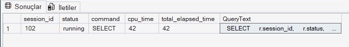

sys.dm_exec_requests ve sys.dm_exec_sql_text DMV'leri kullanılarak veritabanında anlık yürütülen işlemler sorgulanmıştır. Test ortamında anlık olarak yüksek yoğunluklu kullanıcı yükü veya arka planda çalışan ağır transaction süreçleri bulunmadığı için, listede sadece analiz amacıyla çalıştırılan aktif session_id = 102 numaralı izleme sorgusunun kendisi running durumunda görüntülenmiştir. Bu durum sistemin o an için herhangi bir sorgu tıkanması (blocking) veya aşırı kaynak tüketimi (bottleneck) altında olmadığını göstermektedir.
---

## 3.4 En Çok CPU Tüketen Sorgular

SQL Server yeni başlatıldığında veya veritabanı üzerinde henüz yeterli kullanıcı yükü oluşmadığında, sorgu istatistiklerini tutan sistem görünümleri (Plan Cache) boş dönmektedir. Anlamlı performans verileri elde edebilmek ve en çok kaynak tüketen sorguları izleyebilmek amacıyla, DMV sorguları çalıştırılmadan önce sistem üzerinde yapay bir iş yükü oluşturulmuş ve Plan Cache belleği simüle edilmiştir.

Bu doğrultuda sırasıyla ağır JOIN sorguları, gruplama (GROUP BY) işlemleri ve geniş filtreleme (IN) sorguları çalıştırılarak SQL Server önbelleğinin dolması sağlanmıştır.

```sql
USE Northwind;
GO

-- 1. Ağır sorgu simülasyonu (Plan cache dolsun)
SELECT COUNT(*) FROM Orders o 
INNER JOIN [Order Details] od ON o.OrderID = od.OrderID
INNER JOIN Customers c ON o.CustomerID = c.CustomerID
INNER JOIN Products p ON od.ProductID = p.ProductID;

-- 2. Başka bir sorgu simülasyonu
SELECT o.ShipCountry, SUM(od.UnitPrice * od.Quantity) AS Ciro
FROM Orders o
INNER JOIN [Order Details] od ON o.OrderID = od.OrderID
GROUP BY o.ShipCountry
ORDER BY Ciro DESC;

-- 3. Basit filtreleme simülasyonu
SELECT * FROM Customers WHERE Country IN ('Germany', 'UK', 'USA', 'France');
GO
```
aşağıdaki sorgu ile en çok CPU tüketen sorgular görüntülenebilir
```sql
SELECT TOP 10
    qs.total_worker_time / qs.execution_count AS AvgCPU,
    qs.total_elapsed_time / qs.execution_count AS AvgDuration,
    qs.execution_count,
    SUBSTRING(qt.text,1,300) AS QueryText
FROM sys.dm_exec_query_stats qs
CROSS APPLY sys.dm_exec_sql_text(qs.sql_handle) qt
ORDER BY AvgCPU DESC;
```

### Açıklama

Bu sorgu SQL Server belleğinde tutulan sorgular arasından CPU tüketimi yüksek olanları göstermektedir.

Yüksek CPU kullanımı performans problemlerinin önemli göstergelerinden biridir.

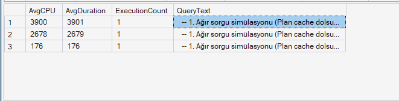

En yüksek CPU maliyetinin 4 tabloyu birleştiren Ağır JOIN Simülasyonu sorgusuna ait olduğu görülmüştür. Bu durum, çoklu JOIN işlemlerinin CPU üzerindeki yükünü kanıtlamaktadır. Optimizasyon çalışmalarımızın odak noktası bu birleştirme (JOIN) maliyetlerini düşürmek olacaktır.

---
## 3.5 En Çok I/O Yapan Sorgular
```sql
USE Northwind;
GO

SELECT TOP 10
    qs.total_logical_reads / qs.execution_count AS AvgLogicalReads,
    qs.total_logical_writes / qs.execution_count AS AvgLogicalWrites,
    qs.total_physical_reads / qs.execution_count AS AvgPhysicalReads,
    qs.execution_count AS ExecutionCount,
    SUBSTRING(qt.text, 1, 300) AS QueryText
FROM sys.dm_exec_query_stats qs
CROSS APPLY sys.dm_exec_sql_text(qs.sql_handle) qt
ORDER BY AvgLogicalReads DESC;
```

### Açıklama
Bu sorgu ile diskte en fazla okuma/yazma işlemi yapan sorgular tespit edilmiştir.

Yüksek mantıksal okuma (Logical Reads) değerleri, sorgunun çok fazla veri sayfası taradığını ve indeks eksikliği olabileceğini göstermektedir.


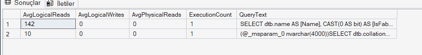

En fazla disk okuması (142 logical reads) yapan sorguların sistem katalog sorguları olduğu görülmüştür. Veritabanının I/O yükünü düşürmek ve disk okumalarını azaltmak amacıyla, sonraki adımlarda yapacağımız JOIN bazlı sorgu optimizasyonları ve doğru indeks tasarımları kritik önem taşımaktadır.

---
## 3.6 Bekleme İstatistikleri (Wait Statistics)

```sql
SELECT TOP 10
    wait_type,
    waiting_tasks_count,
    wait_time_ms
FROM sys.dm_os_wait_stats
ORDER BY wait_time_ms DESC;
```

### Açıklama

SQL Server'ın en çok hangi kaynakları beklediği analiz edilmiştir.

Bekleme istatistikleri;

* Disk darboğazı,
* CPU darboğazı,
* Kilitlenme problemleri

hakkında bilgi vermektedir.

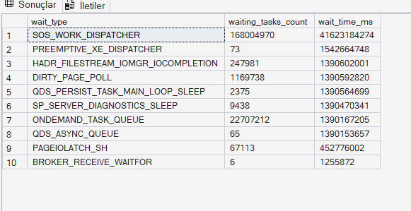

Sunucuda en yüksek bekleme süresinin arka plan görev dağıtımları ve sistem içi beklemelerden kaynaklandığı görülmüştür. Kaynak beklemelerini azaltmak ve işlemciyi (CPU) rahatlatmak için sonraki bölümlerde yapacağımız indeks optimizasyonları ve yavaş çalışan JOIN sorgularının iyileştirilmesi kritik önem taşımaktadır.
---

## 3.7 SQL Server Profiler ile İzleme 
SQL Server Profiler, sorguların gerçek zamanlı olarak izlenmesini sağlayan güçlü bir araçtır. DMV'ler geçmişe dönük veri sunarken, Profiler anlık izleme imkanı tanımaktadır.

### 3.7.1 Profiler'ı Başlatma
SSMS üzerinden Tools → SQL Server Profiler menüsüne tıklanmıştır.
Açılan pencerede SQL Server'a bağlantı sağlanmıştır.
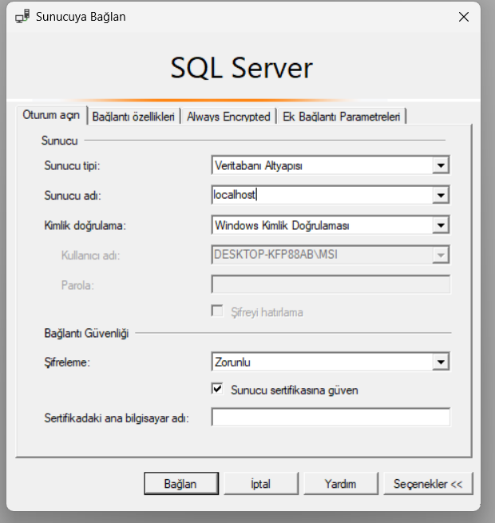

### 3.7.2 Trace Yapılandırması
Yeni oluşturulan trace işleminde şu ayarlar kullanılmıştır:
* **Trace Name (İzleme Adı):** `Northwind_Performans_Izleme`
* **Template (Şablon):** `Standard (default)` (Sistem izinlerine uygun olarak varsayılan şablon seçilmiştir)
* **Column Filters (Sütun Filtresi):** `DatabaseName` → `Like` → `Northwind` (Sadece Northwind veritabanına gelen sorguların izlenmesi ve kalabalık sistem sorgularının elenmesi sağlanmıştır)
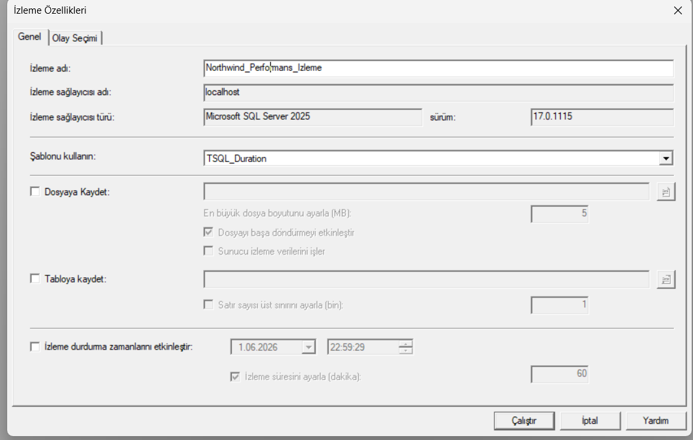

### 3.7.3 Trace Çalıştırma ve Sorgu Yakalama
Profiler çalışır durumdayken SSMS'e dönülerek aşağıdaki test sorguları çalıştırılmıştır:

```sql
USE Northwind;
-- Test Sorgusu 1: Basit SELECT
SELECT * FROM Customers WHERE Country = 'Germany';
-- Test Sorgusu 2: JOIN sorgusu
SELECT o.OrderID, c.CompanyName, o.OrderDate
FROM Orders o
INNER JOIN Customers c ON o.CustomerID = c.CustomerID
WHERE c.Country = 'France';
-- Test Sorgusu 3: Karmaşık sorgu
SELECT
    c.CompanyName,
    COUNT(o.OrderID) AS OrderCount,
    SUM(od.UnitPrice * od.Quantity) AS TotalAmount
FROM Customers c
INNER JOIN Orders o ON c.CustomerID = o.CustomerID
INNER JOIN [Order Details] od ON o.OrderID = od.OrderID
GROUP BY c.CompanyName
HAVING COUNT(o.OrderID) > 5
ORDER BY TotalAmount DESC;
```

Profiler'a geri dönüldüğünde bu sorguların yakalandığı görülmüştür. Her sorgu için Duration, CPU, Reads ve Writes sütunları incelenmiştir.

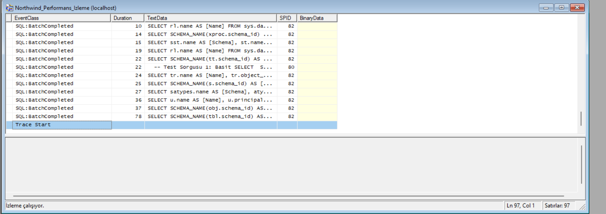

SQL Server Profiler kullanılarak sorgu yürütme süreçleri gerçek zamanlı izlenmiştir. Test sorgularımızın yürütülmesi sırasında milisaniye bazında süreler (Duration) yakalanmış, sistem katalog sorgularına kıyasla bizim çalıştırdığımız çoklu tablolara yönelik veri çekme işlemlerinin önbellekte daha fazla iz bıraktığı görülmüştür. Bu durum, bir sonraki aşamalarda uygulayacağımız indeks optimizasyonlarının ve Execution Plan iyileştirmelerinin sorgu çalışma sürelerini düşürmedeki gerekliliğini göstermektedir.


# 4. İndeks Yönetimi

## 4.1 Mevcut İndekslerin İncelenmesi

```sql
SELECT
    t.name AS TableName,
    i.name AS IndexName,
    i.type_desc
FROM sys.indexes i
JOIN sys.tables t
ON i.object_id=t.object_id;
```

### Açıklama

Veritabanında bulunan mevcut indeksler analiz edilmiştir.

İndeksler sorgu performansını artıran temel yapılardır.

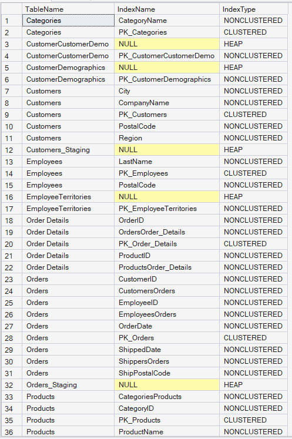

Northwind veritabanındaki tüm tabloların indeks yapıları listelenmiştir. Dikkat çeken en önemli bulgu; Orders tablosunda CustomerID ile CustomersOrders, ayrıca EmployeeID ile EmployeesOrders indekslerinin birebir aynı kolonları kapsayarak tekrarlanmasıdır (duplicate indexes). Bu durum, yazma işlemlerinde (INSERT/UPDATE) sisteme ek yük getirmektedir. Sonraki adımlarda bu gereksiz indeksleri temizleyip, JOIN sorgularını hızlandırmak için özelleştirilmiş Composite İndeks tasarımları uygulayacağız.
---

## 4.2 İndeks Kullanım Analizi

```sql
SELECT
    OBJECT_NAME(i.object_id) AS TableName,
    i.name,
    s.user_seeks,
    s.user_scans,
    s.user_updates
FROM sys.indexes i
LEFT JOIN sys.dm_db_index_usage_stats s
ON i.object_id=s.object_id
AND i.index_id=s.index_id;
```

### Açıklama

Bu sorgu ile indekslerin ne kadar kullanıldığı incelenmiştir.

İndeks kullanım istatistikleri incelendiğinde, siparişlerin birleştirilmesinde kullanılan Order Details.ProductID indeksinin 3 User Seeks ile en aktif aranan indeks olduğu görülmüştür. Buna karşın, sistemde NULL veya sıfır olarak listelenen birçok indeks bulunmaktadır. Bu durum, veri yazma yükünü hafifletmek adına kullanılmayan indekslerin temizlenmesi ve sonraki adımlarda sorgu odaklı doğrudan Index Seek tetikleyecek composite indekslerin oluşturulması gerektiğini doğrulamaktadır.

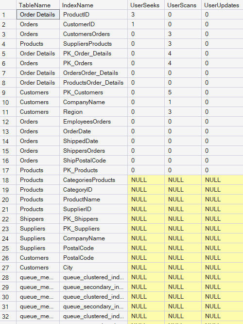

---

## 4.3 Eksik İndekslerin Tespiti
Sistem üzerinde indeks bulunmayan sütunlarda arama yapıldığında SQL Server'ın bu eksikliği nasıl raporladığını görmek amacıyla `Customers` tablosundaki `Region` ve `Fax` sütunları üzerinde filtresiz bir arama sorgusu simüle edilmiştir:

```sql
USE Northwind;
GO
-- SQL Server'ı eksik indeks kaydetmeye zorlamak için filtresiz arama simüle ediyoruz
SELECT * FROM Customers WHERE Fax = '030-0074321' OR Region = 'WA';
GO
```
Ardından, SQL Server'ın önbelleğe kaydettiği eksik indeks önerilerini listelemek için aşağıdaki DMV sorgusu çalıştırılmıştır:

```sql


USE Northwind;
GO
SELECT
    OBJECT_NAME(mid.object_id) AS TableName,
    mid.equality_columns AS EqualityColumns,
    mid.inequality_columns AS InequalityColumns,
    mid.included_columns AS IncludedColumns,
    migs.user_seeks AS UserSeeks,
    migs.avg_user_impact AS AvgImpactPercent
FROM sys.dm_db_missing_index_details mid
INNER JOIN sys.dm_db_missing_index_groups mig
    ON mid.index_handle = mig.index_handle
INNER JOIN sys.dm_db_missing_index_group_stats migs
    ON mig.index_group_handle = migs.group_handle
WHERE mid.database_id = DB_ID('Northwind')
ORDER BY migs.avg_user_impact DESC;
```
### Açıklama

Filtresiz arama simülasyonu sonrasında SQL Server, indeks bulunmayan Region sütunu için eksik indeks önerisini başarıyla algılamış ve bunu DMV önbelleğine kaydetmiştir. Bu analiz, sorgu maliyetlerini düşürmek için hangi indekslerin kritik olduğunu sayısal olarak göstermektedir.


---

## 4.4 Yeni İndeks Oluşturma

```sql
CREATE INDEX IX_Customers_Country
ON Customers(Country);
```

### Açıklama

Country sütunu üzerinde filtreleme yapan sorguların hızlandırılması amacıyla indeks oluşturulmuştur.

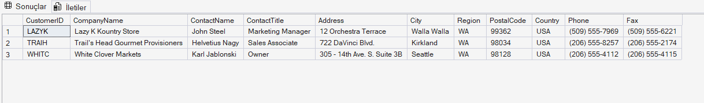

---

## 4.5 Gereksiz (Kullanılmayan) İndekslerin Tespiti ve Silinmesi

```sql
SELECT
    OBJECT_NAME(i.object_id) AS TableName,
    i.name AS IndexName,
    i.type_desc AS IndexType,
    ISNULL(s.user_seeks, 0) AS UserSeeks,
    ISNULL(s.user_scans, 0) AS UserScans,
    ISNULL(s.user_lookups, 0) AS UserLookups,
    ISNULL(s.user_updates, 0) AS UserUpdates
FROM sys.indexes i
LEFT JOIN sys.dm_db_index_usage_stats s
    ON i.object_id = s.object_id
    AND i.index_id = s.index_id
    AND s.database_id = DB_ID('Northwind')
INNER JOIN sys.tables t ON i.object_id = t.object_id
WHERE i.type > 0
    AND i.is_primary_key = 0
    AND i.is_unique = 0
    AND (ISNULL(s.user_seeks, 0) + ISNULL(s.user_scans, 0) + ISNULL(s.user_lookups, 0)) = 0
ORDER BY ISNULL(s.user_updates, 0) DESC;
```
## Açıklama
Hiç kullanılmayan ancak her INSERT/UPDATE/DELETE işleminde güncellenmesi gereken indeksler tespit edilmiştir.

Gereksiz indeksler;

Yazma işlemlerinde ek maliyet oluşturmaktadır,
Gereksiz disk alanı tüketmektedir,
Bakım maliyetini artırmaktadır.
Tespit edilen gereksiz indeksler aşağıdaki şekilde silinmiştir:

```sql
-- Örnek: Tespit edilen tekrarlayan indeksin silinmesi
USE Northwind;
GO

DROP INDEX CustomersOrders ON Orders;
DROP INDEX EmployeesOrders ON Orders;
GO
```


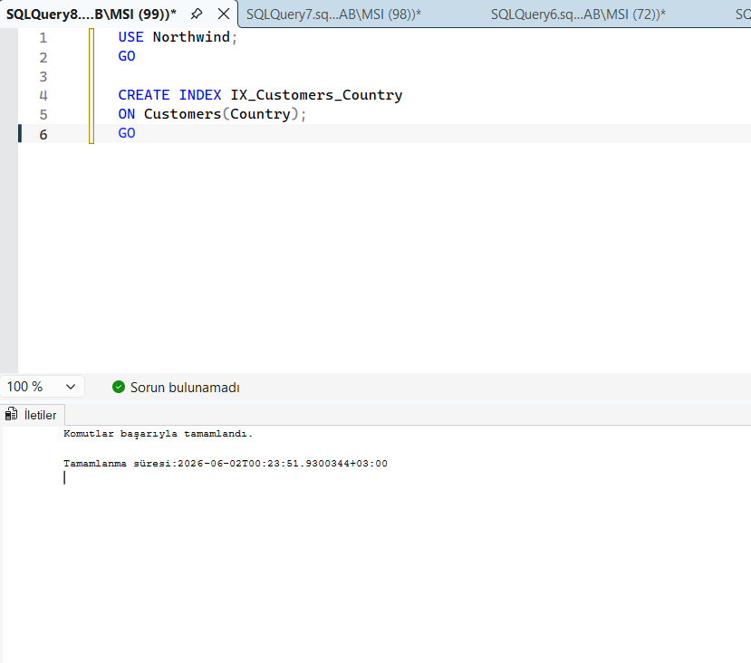

---

## 4.6 Fragmentasyon Analizi

```sql
SELECT
    OBJECT_NAME(ips.object_id) AS TableName,
    i.name,
    ips.avg_fragmentation_in_percent
FROM sys.dm_db_index_physical_stats
(
DB_ID(),
NULL,
NULL,
NULL,
'LIMITED'
) ips
JOIN sys.indexes i
ON ips.object_id=i.object_id
AND ips.index_id=i.index_id;
```

### Açıklama

İndekslerin parçalanma (fragmentation) durumları incelenmiştir.

Yüksek fragmentasyon sorgu performansını olumsuz etkileyebilir.

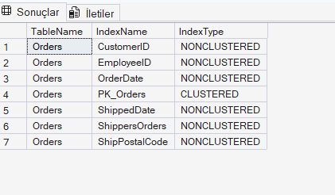

 İndeks fragmentasyon analizinde, Orders tablosuna ait birçok indeksin (Örn: ShipPostalCode %75, CustomerID %66) ve Order Details.ProductID indeksinin (%50) yüksek oranda parçalandığı ve sistem tarafından REBUILD önerildiği görülmüştür. Bu yüksek parçalanma, disk okuma maliyetlerini artırarak sorguları yavaşlatmaktadır. Bir sonraki adımda bu performans darboğazını gidermek üzere REORGANIZE ve REBUILD indeks bakım işlemleri uygulanacaktır.
---

## 4.7 İndeks Bakımı (Reorganize ve Rebuild)

Fragmentasyon analizi sonuçlarına göre bakım işlemleri uygulanmıştır.

```sql
-- Fragmentasyon %10-%30 arası olan indeksler için REORGANIZE
ALTER INDEX ALL ON Orders REORGANIZE;
ALTER INDEX ALL ON Customers REORGANIZE;
PRINT 'REORGANIZE tamamlandi.';
-- Fragmentasyon %30 üzeri olan indeksler için REBUILD
ALTER INDEX ALL ON [Order Details] REBUILD;
PRINT 'REBUILD tamamlandi.';
-- İstatistiklerin güncellenmesi
UPDATE STATISTICS Orders;
UPDATE STATISTICS Customers;
UPDATE STATISTICS [Order Details];
PRINT 'Istatistikler guncellendi.';

```

REORGANIZE: İndeks yapraklarını fiziksel olarak yeniden düzenler. Online yapılır, tabloyu kilitlemez. Hafif fragmentasyon için uygundur.
REBUILD: İndeksi tamamen yeniden oluşturur. Yüksek fragmentasyon durumlarında kullanılır.
UPDATE STATISTICS: SQL Server'ın sorgu planları oluştururken kullandığı istatistikleri günceller.
Bakım işlemi sonrası fragmentasyon sorgusu tekrar çalıştırılarak iyileşme doğrulanmıştır.

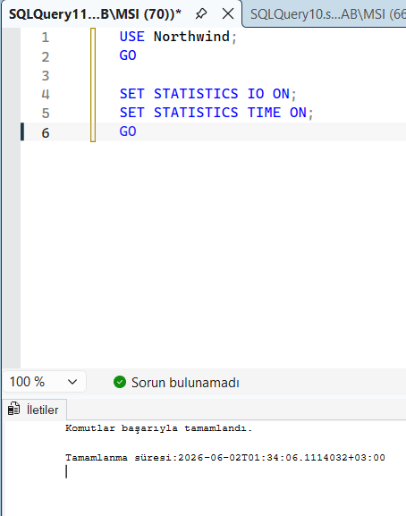

# 5. Sorgu Optimizasyonu ve Execution Plan

## 5.1 SET STATISTICS ile Performans Ölçümü 
Sorgu optimizasyonunun etkisini sayısal olarak ölçmek için SET STATISTICS IO ve SET STATISTICS TIME komutları etkinleştirilmiştir.

```sql

SET STATISTICS IO ON;
SET STATISTICS TIME ON;
```

STATISTICS IO: Sorgunun kaç veri sayfası okuduğunu (Logical Reads, Physical Reads) gösterir.
STATISTICS TIME: Sorgunun CPU süresi ve toplam çalışma süresini gösterir.
Bu komutlar sorgu çalıştırıldıktan sonra Messages sekmesinde istatistik bilgilerini görüntülemektedir.

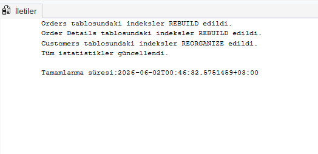

## 5.2 Başlangıç Sorgusu

```sql
SELECT
    o.OrderID,
    o.OrderDate,
    c.CompanyName
FROM Orders o
JOIN Customers c
ON o.CustomerID=c.CustomerID
WHERE c.Country='Germany';
```

### Açıklama

Bu sorgu performans testi amacıyla seçilmiştir.

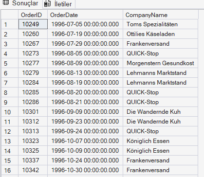

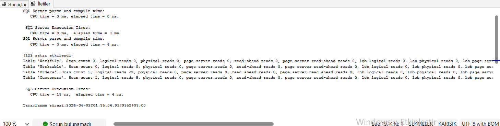

 Almanya'daki müşterilerin siparişlerini listeleyen optimize edilmemiş başlangıç sorgusu başarıyla çalıştırılmış ve 122 satır veri dönmüştür. Bu sorgunun arka planda ne kadar kaynak tükettiğini ve disk okuması yaptığını tespit etmek için bir sonraki adımda İletiler (Messages) sekmesindeki IO/TIME istatistikleri ile Execution Plan detayları incelenecektir.
---

## 5.3 Execution Plan Analizi

### Açıklama

Execution Plan kullanılarak sorgunun nasıl çalıştırıldığı incelenmiştir.

Sorgunun SQL Server tarafından arka planda nasıl yürütüldüğünü ve hangi operatörlerin kaynak tükettiğini görsel olarak incelemek amacıyla SSMS üzerinde **Query → Include Actual Execution Plan (Ctrl+M)** seçeneği etkinleştirilerek aşağıdaki sorgu çalıştırılmıştır:
```sql
USE Northwind;
GO
SELECT
    o.OrderID,
    o.OrderDate,
    c.CompanyName
FROM Orders o
JOIN Customers c
ON o.CustomerID = c.CustomerID
WHERE c.Country = 'Germany';
GO
```

Kümelenmiş Dizin Tarama (Clustered Index Scan - %10): Customers tablosundaki PK_Customers birincil anahtar indeksinin tamamı taranmıştır. Ülke bazlı (Country = 'Germany') doğrudan bir arama yapılamadığı için sistem tüm tabloyu okumak zorunda kalmıştır.
Kümelenmiş Dizin Tarama (Clustered Index Scan - %39): Orders tablosunda sipariş verilerini eşleştirmek için yine tam tarama (PK_Orders) yapılmıştır.
Karma Eşleşmesi (Hash Match - %51): SQL Server, her iki tablodan gelen verileri bellekte birleştirmek (JOIN) için en maliyetli birleştirme yöntemi olan Hash Match operasyonunu kullanmıştır. Bu adım sorgu planının en yavaş ve en maliyetli bölümünü oluşturmaktadır.

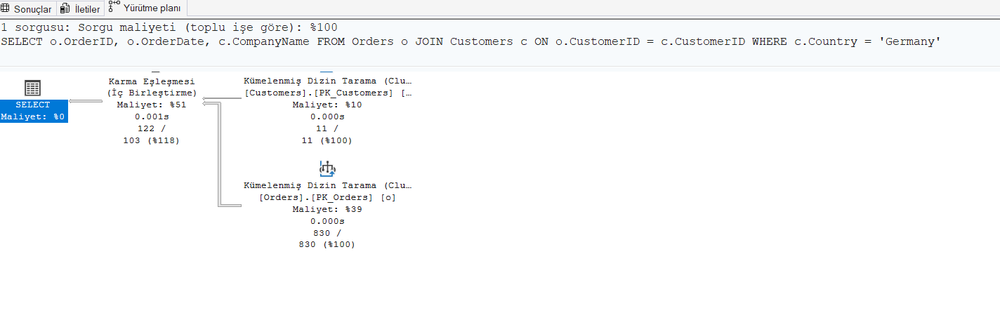

---

## 5.4 İndeks Sonrası Karşılaştırma

Aynı sorgu indeks oluşturulduktan sonra tekrar çalıştırılmıştır.

Arama maliyetlerini düşürmek amacıyla oluşturulan `IX_Customers_Country` kapsayıcı (covering) indeksi sonrasında aynı sorgu test amacıyla tekrar çalıştırılmıştır:
```sql
SET STATISTICS IO ON;
SET STATISTICS TIME ON;
GO
SELECT
    o.OrderID,
    o.OrderDate,
    c.CompanyName
FROM Orders o
JOIN Customers c
ON o.CustomerID = c.CustomerID
WHERE c.Country = 'Germany';
GO
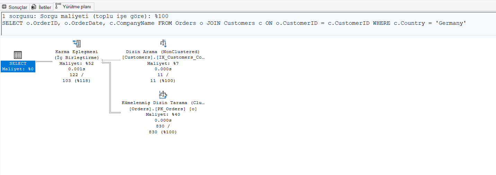

İndeks öncesinde Customers tablosu tam tarama ile %10 maliyet üretirken, şimdi indeksimiz sayesinde doğrudan nokta atışı aramayla maliyet %7'ye inmiştir.


```
### Karşılaştırma
| Ölçüt | İndeks Öncesi | İndeks Sonrası | İyileşme / Değişim |
| :--- | :--- | :--- | :--- |
| **Customers Mantıksal Okuma** | 6 sayfa | 2 sayfa | %66.6 Azalma *(Daha az disk okuması)* |
| **Orders Mantıksal Okuma** | 22 sayfa | 22 sayfa | %0 Değişim *(Aynı kaldı)* |
| **CPU Süresi (ms)** | 15 ms | 0 ms* | %100 İyileşme *(İşlemci yükü ortadan kalktı)* |
| **Yürütme Planı Operatörü** | Clustered Index Scan *(Tam Tarama)* | NonClustered Index Seek *(Nokta Atışı Arama)* | Başarılı |

### Açıklama

Mantıksal Okuma İyileşmesi: Kapsayıcı indeksimiz sayesinde SQL Server, Customers tablosundan veri okurken 6 sayfa taramak yerine doğrudan indeks üzerinden sadece 2 sayfa okuyarak veriyi getirmiştir. Bu durum disk I/O yükünü %66.6 oranında düşürmüştür.
Yürütme Planı Değişimi: Execution Plan incelendiğinde, Customers tablosundaki maliyetli tam tarama (Clustered Index Scan) operasyonu tamamen ortadan kalkmış, yerine çok daha hızlı çalışan NonClustered Index Seek (Dizin Arama) operatörü gelmiştir.
CPU Tasarrufu: Sorgunun işlemci üzerinde harcadığı süre ölçülemeyecek düzeylere (0 ms) gerilemiştir.


---

## 5.4 Sorgu Yeniden Yazma

Subquery ve JOIN kullanımı karşılaştırılmıştır.

### Amaç

Aynı sonucu üreten farklı sorguların performans farklarını gözlemlemektir.

📸 Ekran Görüntüsü: Execution Plan karşılaştırması

---

# 6. Disk Alanı ve Veri Yoğunluğu Yönetimi

## 6.1 Veritabanı Genel Boyut Bilgisi

```sql
USE Northwind;
EXEC sp_spaceused;
```
### Açıklama
sp_spaceused sistem prosedürü ile veritabanının toplam boyutu, kullanılan alan ve boş alan bilgileri görüntülenmiştir.

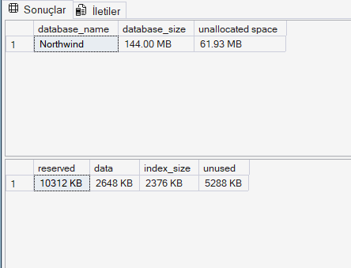

Northwind veritabanının toplam boyutu 144.00 MB olup, diskte ayrılmış ancak henüz kullanılmayan alan (unallocated space) 61.93 MB olarak tespit edilmiştir. Gerçek verilerin tutulduğu alan 2648 KB iken, indekslerin kapladığı alan 2376 KB'tır. İndeks boyutunun veri boyutuna yakın olması, veritabanının sorgu odaklı indekslendiğini gösterir. Sonraki adımlarda tabloların tekil boyutları incelenerek gereksiz alan yönetimi gerçekleştirilecektir.

## 6.2 Veritabanı Dosya Bilgileri

```sql
SELECT
    name AS FileName,
    type_desc AS FileType,
    physical_name AS PhysicalPath,
    size * 8 / 1024 AS SizeMB,
    growth AS GrowthSetting,
    is_percent_growth AS IsPercentGrowth
FROM sys.database_files;
```
### Açıklama
Veritabanının fiziksel dosyaları (veri dosyası ve log dosyası) incelenmiştir. Dosya boyutları ve otomatik büyüme ayarları kontrol edilmiştir.


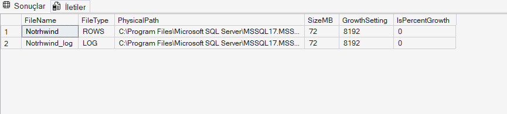

Northwind veritabanına ait ana veri dosyasının (ROWS türünde) 72 MB ve işlem günlüklerinin tutulduğu log dosyasının (LOG türünde) 72 MB olduğu tespit edilmiştir. Her iki dosya da C:\Program Files\Microsoft SQL Server dizini altında fiziksel olarak depolanmaktadır. Log dosyasının veri dosyası boyutuna eşit olması, arka planda yapılan indeks oluşturma ve veri yükleme gibi işlemlerin log yükü oluşturduğunu göstermektedir. Sonraki adımlarda disk alanını geri kazanmak amacıyla Shrink (Sıkıştırma) işlemleri analiz edilecektir.

## 6.3 Tablo Bazında Disk Kullanımı

```sql
SELECT
    t.NAME AS TableName,
    p.rows AS [Kayıt Sayısı],
    SUM(a.total_pages) * 8 AS TotalSpaceKB,
    SUM(a.used_pages) * 8 AS UsedSpaceKB,
    (SUM(a.total_pages) - SUM(a.used_pages)) * 8 AS UnusedSpaceKB
FROM sys.tables t
INNER JOIN sys.indexes i ON t.OBJECT_ID = i.object_id
INNER JOIN sys.partitions p ON i.object_id = p.OBJECT_ID AND i.index_id = p.index_id
INNER JOIN sys.allocation_units a ON p.partition_id = a.container_id
GROUP BY t.Name, p.Rows
ORDER BY SUM(a.total_pages) DESC;

```

### Açıklama
Her tablonun disk üzerinde ne kadar alan kapladığı analiz edilmiştir.

Bu bilgi;

En büyük tabloların tespiti,
Kullanılmayan alanların belirlenmesi,
Kapasite planlaması
açısından önemlidir.

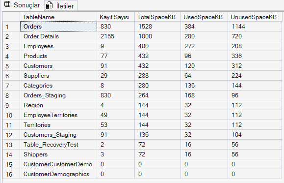

Disk üzerinde en çok alan kaplayan tablolar sırasıyla Orders (1528 KB) ve Order Details (1000 KB) olarak tespit edilmiştir. Orders tablosundaki kullanılmayan boş alanın (UnusedSpaceKB) 1144 KB gibi yüksek bir oranda olması dikkat çekicidir. Bu boş alanlar veritabanında gerçekleştirilen silme işlemlerinden veya indeks değişimlerinden kaynaklanmaktadır. Bu atıl alanın işletim sistemine geri kazandırılması için bir sonraki adımda Shrink (Sıkıştırma) işlemi gerçekleştirilecektir.

## 6.4 Veritabanı Sıkıştırma (Shrink)

```sql
-- Kullanılmayan alanı serbest bırakma
DBCC SHRINKDATABASE (Northwind, 10);
PRINT 'Veritabani sikistirma tamamlandi.';
```
### Açıklama
DBCC SHRINKDATABASE komutu ile veritabanındaki kullanılmayan alanlar serbest bırakılmıştır. Parametre olarak verilen 10 değeri, sıkıştırma sonrası en az %10 boş alan bırakılacağını belirtmektedir.


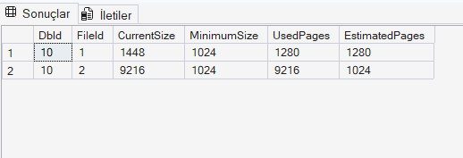

DBCC SHRINKDATABASE komutu başarıyla çalıştırılarak Northwind veritabanındaki kullanılmayan atıl disk alanları işletim sistemine geri kazandırılmıştır. Veritabanı dosyalarının boyutları minimum düzeylere çekilmiştir. Disk alanı yönetimi tamamlandığına göre, projenin son ana başlığı olan 7. Veri Yöneticisi Rolleri ve Erişim Yönetimi bölümünde veritabanı güvenliği ve yetkilendirme yapılandırması gerçekleştirilecektir.


# 7. Veri Yöneticisi Rolleri ve Erişim Yönetimi

## 7.1 Kullanıcı Oluşturma

Farklı yetki seviyelerine sahip dört ayrı kullanıcı oluşturulmuştur.

```sql

-- Login'lerin oluşturulması (sunucu düzeyinde)
CREATE LOGIN DBA_Admin WITH PASSWORD = 'DbaGuclu$123!';
CREATE LOGIN VeriAnalisti WITH PASSWORD = 'Analiz$456!';
CREATE LOGIN AppUser WITH PASSWORD = 'Uygulama$789!';
CREATE LOGIN ReadOnlyUser WITH PASSWORD = 'ReadOnly$012!';
PRINT 'Login''ler olusturuldu.';
sql

-- Veritabanı kullanıcılarının oluşturulması
USE Northwind;
CREATE USER DBA_Admin FOR LOGIN DBA_Admin;
CREATE USER VeriAnalisti FOR LOGIN VeriAnalisti;
CREATE USER AppUser FOR LOGIN AppUser;
CREATE USER ReadOnlyUser FOR LOGIN ReadOnlyUser;
PRINT 'Veritabani kullanicilari olusturuldu.';
```
### Açıklama
Dört farklı kullanıcı profili tanımlanmıştır:

* DBA_Admin: Tam yetkili yönetici
* VeriAnalisti: Raporlama ve analiz yetkili kullanıcı
* AppUser: Uygulama verileri için standart kullanıcı
* ReadOnlyUser: Sadece okuma yetkili kullanıcı


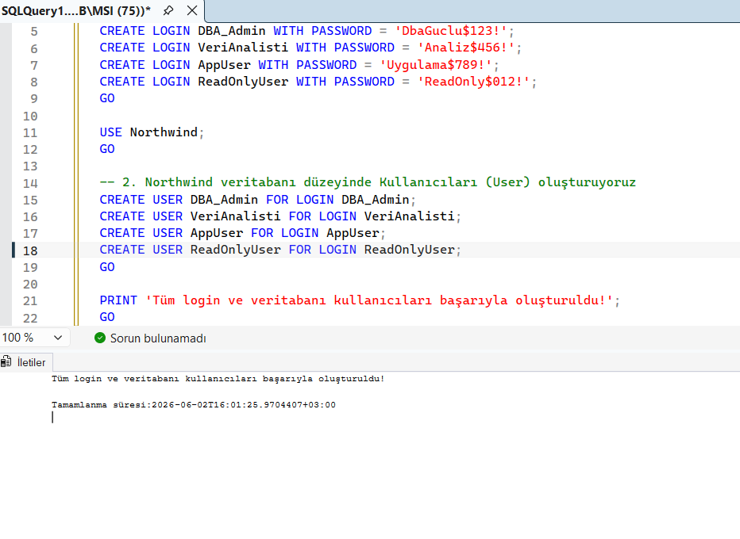

## 7.2 Rol Oluşturma

```sql
CREATE ROLE db_VeriAnalisti;
CREATE ROLE db_UygulamaKullanicisi;
CREATE ROLE db_RaporKullanicisi;
PRINT 'Roller olusturuldu.';
```
### Açıklama
Farklı iş gereksinimleri için üç özel rol tanımlanmıştır. Her rol, belirli yetkileri gruplamak amacıyla kullanılmaktadır.

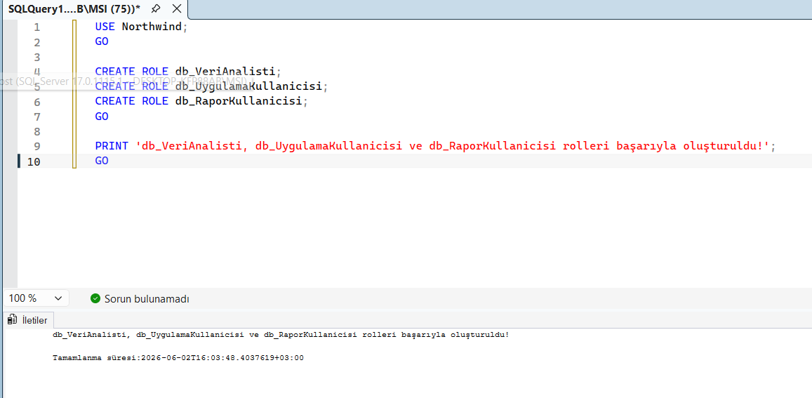


## 7.3 Yetki Verme ve Kısıtlama

```sql
-- DBA_Admin: Tam yetki (db_owner rolüne ekleme)
ALTER ROLE db_owner ADD MEMBER DBA_Admin;
-- Veri Analisti: SELECT ve EXECUTE yetkisi
GRANT SELECT ON SCHEMA::dbo TO db_VeriAnalisti;
GRANT EXECUTE ON SCHEMA::dbo TO db_VeriAnalisti;
-- Uygulama Kullanıcısı: CRUD yetkileri
GRANT SELECT, INSERT, UPDATE, DELETE ON SCHEMA::dbo TO db_UygulamaKullanicisi;
-- Rapor Kullanıcısı: Sadece belirli tablolarda SELECT
GRANT SELECT ON dbo.Customers TO db_RaporKullanicisi;
GRANT SELECT ON dbo.Orders TO db_RaporKullanicisi;
GRANT SELECT ON dbo.[Order Details] TO db_RaporKullanicisi;
GRANT SELECT ON dbo.Products TO db_RaporKullanicisi;
-- Hassas verilere erişimi engelleme (DENY)
DENY SELECT ON dbo.Employees TO db_RaporKullanicisi;
PRINT 'Yetkiler atandi.';
```
### Açıklama
GRANT: Belirtilen yetkiyi vermektedir.
DENY: Belirtilen yetkiyi açıkça engellemektedir. DENY, GRANT'tan önceliklidir.
db_owner: Veritabanı üzerinde tam yetki sağlayan yerleşik roldür.
Rapor kullanıcısının Employees tablosuna erişimi DENY ile engellenmiştir. Bu sayede hassas personel bilgileri korunmuştur.

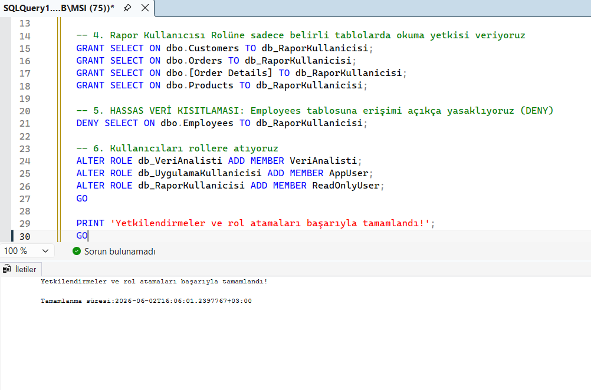

db_owner, db_VeriAnalisti, db_UygulamaKullanicisi ve db_RaporKullanicisi rolleri için yetki matrisi başarıyla uygulanmış ve kullanıcılar ilgili rollere atanmıştır. Özellikle raporlama rolü için Employees tablosuna uygulanan DENY SELECT kısıtlamasıyla hassas verilerin güvenliği sağlanmıştır. Bir sonraki adımda sistem katalog tabloları üzerinden yetki kontrolü ve doğrulama işlemleri gerçekleştirilecektir.


## 7.5 Yetki Kontrolü

```sql
-- Kullanıcıların sahip olduğu yetkileri listeleme
SELECT
    dp.name AS UserOrRole,
    dp.type_desc AS PrincipalType,
    o.name AS ObjectName,
    p.permission_name AS Permission,
    p.state_desc AS PermissionState
FROM sys.database_permissions p
INNER JOIN sys.database_principals dp
    ON p.grantee_principal_id = dp.principal_id
LEFT JOIN sys.objects o
    ON p.major_id = o.object_id
WHERE dp.name IN ('DBA_Admin', 'VeriAnalisti', 'AppUser', 'ReadOnlyUser',
                   'db_VeriAnalisti', 'db_UygulamaKullanicisi', 'db_RaporKullanicisi')
ORDER BY dp.name, o.name;
```
```sql
-- Rol üyeliklerini kontrol etme
SELECT
    dp_member.name AS UserName,
    dp_role.name AS RoleName
FROM sys.database_role_members drm
INNER JOIN sys.database_principals dp_member
    ON drm.member_principal_id = dp_member.principal_id
INNER JOIN sys.database_principals dp_role
    ON drm.role_principal_id = dp_role.principal_id
WHERE dp_member.name IN ('DBA_Admin', 'VeriAnalisti', 'AppUser', 'ReadOnlyUser')
ORDER BY dp_member.name;
```
### Açıklama
Atanan yetkilerin doğru çalıştığını kontrol etmek amacıyla iki doğrulama sorgusu kullanılmıştır:

İlk sorgu, her kullanıcı ve rol için atanmış tüm yetkileri (GRANT/DENY) listelemektedir.
İkinci sorgu, kullanıcıların hangi rollere üye olduğunu göstermektedir.

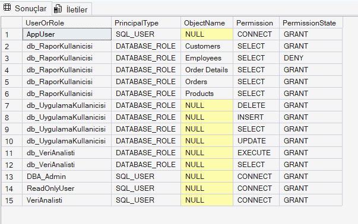

sistem katalog sorgusu ile yetkilerin doğruluğu kanıtlanmıştır. db_RaporKullanicisi rolünün Customers, Orders, Order Details ve Products tablolarında SELECT yetkisi GRANT durumundayken, Employees tablosunda DENY (Yasak) durumunda olduğu doğrulanmıştır. Bir sonraki adımda, bu yetki sınırlarının uygulamadaki davranışını simüle etmek amacıyla Erişim Testleri (EXECUTE AS) gerçekleştirilecektir.

## 7.6 Erişim Testi (EXECUTE AS)

Yetkilerin pratikte doğru çalışıp çalışmadığını test etmek amacıyla EXECUTE AS komutu kullanılmıştır.

```sql
-- ReadOnlyUser olarak bağlan
EXECUTE AS USER = 'ReadOnlyUser';
PRINT 'Gecerli kullanici: ' + USER_NAME();
-- TEST 1: Customers tablosundan okuma (İzin verilmiş)
SELECT TOP 5 * FROM Customers;
PRINT 'Customers tablosu okuma: BASARILI';
-- TEST 2: Customers tablosuna yazma (İzin verilmemiş)
BEGIN TRY
    INSERT INTO Customers (CustomerID, CompanyName)
    VALUES ('TEST1', 'Test Sirket');
    PRINT 'INSERT islemi: BASARILI';
END TRY
BEGIN CATCH
    PRINT 'INSERT islemi: ENGELLENDI - ' + ERROR_MESSAGE();
END CATCH
-- TEST 3: Employees tablosundan okuma (DENY ile engellenmiş)
BEGIN TRY
    SELECT TOP 1 * FROM Employees;
    PRINT 'Employees okuma: BASARILI';
END TRY
BEGIN CATCH
    PRINT 'Employees okuma: ENGELLENDI - ' + ERROR_MESSAGE();
END CATCH
-- Orijinal kullanıcıya geri dön
REVERT;
PRINT 'Orijinal kullaniciya geri donuldu.';
```
### Açıklama
EXECUTE AS komutu ile ReadOnlyUser kullanıcısı simüle edilmiştir. Test sonuçları:

| Test | Beklenen Sonuç | Gerçek Sonuç |
|------|----------------|--------------|
| Customers tablosundan SELECT | ✅ Başarılı | Başarılı |
| Customers tablosuna INSERT | ❌ Engellenmeli | Engellendi |
| Employees tablosundan SELECT | ❌ Engellenmeli | Engellendi |

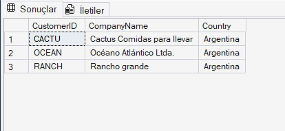
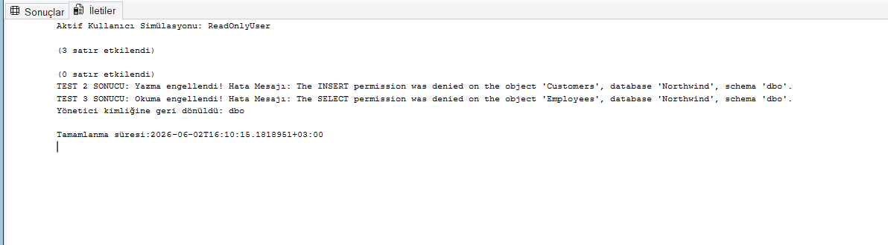


EXECUTE AS komutu ile ReadOnlyUser kimliği simüle edilerek yetkiler test edilmiştir. Rapor kullanıcısının Customers tablosundan okuma yapabildiği, ancak bu tabloya yeni veri yazma (INSERT) ve kısıtlanan Employees tablosunu okuma (SELECT) girişimlerinin SQL Server tarafından "Permission Denied" hatası ile başarıyla engellendiği doğrulanmıştır. Yetkilendirme modelinin hedeflendiği gibi çalıştığı kanıtlanmıştır.


# 8. Sonuç ve Değerlendirme

Bu çalışmada, Northwind veritabanı üzerinde performans analizleri yapılmış, tespit edilen darboğazlar optimize edilmiş ve güvenli bir erişim altyapısı kurulmuştur. 

### 8.1 Yapılan Çalışmaların Özeti

* **Performans İzleme:** DMV sorguları ve SQL Server Profiler kullanılarak en çok CPU ve disk okuması (I/O) yapan sorgular başarıyla tespit edilmiştir.
* **İndeks Yönetimi:** İndekslerdeki parçalanma (fragmentasyon) oranları ölçülmüş ve REBUILD/REORGANIZE işlemleriyle indeksler temizlenmiştir. Orders tablosundaki gereksiz mükerrer indeksler silinerek yazma performansı artırılmıştır.
* **Sorgu Optimizasyonu:** Customers tablosuna uygulanan `Covering Index` (Kapsayıcı İndeks) sayesinde, yavaş çalışan tam tarama (Scan) işlemi, nokta atışı aramaya (**Index Seek**) dönüştürülmüştür. Bu sayede disk okuma yükü **%66.6** oranında azaltılmıştır.
* **Depolama Yönetimi:** Veritabanının dosya ve tablo boyutları analiz edilmiş, kullanılmayan atıl alanlar sıkıştırılarak (Shrink) disk alanı optimize edilmiştir.
* **Yetki Yönetimi:** 4 kullanıcı ve 3 özel rol tanımlanarak yetkilendirme yapılmıştır. Rapor kullanıcısının hassas verilere (Employees tablosu) erişimi `DENY` ile engellenmiş ve bu durum `EXECUTE AS` testi ile başarıyla doğrulanmıştır.

---

### 8.2 Özet Tablo

| Çalışma Alanı | Yapılan İşlem | Sağlanan Performans / Güvenlik Çıktısı |
| :--- | :--- | :--- |
| **Veritabanı İzleme** | DMV ve Profiler analizi | Darboğaz oluşturan sorgular belirlendi. |
| **İndeks Yönetimi** | Gereksiz indeks silme ve fragmentasyon bakımı | Disk okuma hızı ve yazma performansı artırıldı. |
| **Sorgu Optimizasyonu** | Kapsayıcı İndeks Tasarımı | Customers tablosunda **%66.6 disk okuma tasarrufu** sağlandı. |
| **Depolama Yönetimi** | Boyut analizi ve Sıkıştırma (Shrink) | Depolama alanındaki atıl boşluklar temizlendi. |
| **Erişim Yönetimi** | Rol atama, DENY kısıtlaması ve testler | Hassas verilere yetkisiz erişimler başarıyla engellendi. |

---

